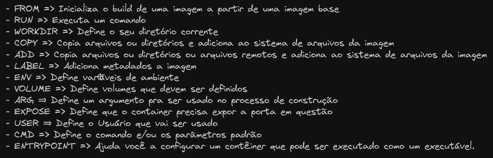

  

**Como fazer um build de uma imagem:**

Para fazer um build de uma imagem usando o Dockerfile fornecido, siga os seguintes passos:

1. Abra o terminal e navegue até o diretório onde o Dockerfile está localizado.
2. Execute o comando `docker build -t nome-da-imagem .`, substituindo "nome-da-imagem" pelo nome desejado para a imagem.
3. Aguarde o processo de build ser concluído. Isso pode levar alguns minutos, dependendo do tamanho do projeto.
4. Após o build ser concluído com sucesso, a imagem estará pronta para ser usada. Você pode executá-la usando o comando `docker run -p porta-local:porta-container nome-da-imagem`, substituindo "porta-local" pela porta desejada em sua máquina local e "porta-container" pela porta configurada no Dockerfile.

Certifique-se de ter o Docker instalado e configurado corretamente antes de prosseguir com o build da imagem.

  

**Estrutura dos diretórios:**

```Bash
leo@linux:~/desenvolvimento/doasanguepoa$ tree -L 1 .
.
├── build
├── config
├── cypress
├── cypress.config.js
├── docker-compose.yml
├── Dockerfile
├── estrutura_aplicacao.jpeg
├── node_modules
├── package.json
├── package-lock.json
├── public
├── README.md
└── src
```

**Dockerfile para build:**

```Docker
FROM node:18-alpine AS builder
WORKDIR /app
COPY package*.json .
RUN npm install
COPY . .
RUN npm run build

\#Geração da imagem do Nginx para rodar o projeto
FROM nginx:stable-alpine3.17-slim
COPY ./config/ngnix.conf /etc/nginx/conf.d/default.conf
WORKDIR /usr/share/nginx/html
RUN rm -rf ./*
COPY --from=builder /app/build .
ENTRYPOINT ["nginx", "-g", "daemon off;"]
```

  



  

WORKDIR:

WORKDIR é uma instrução usada em um Dockerfile para definir o diretório de trabalho para quaisquer instruções subsequentes que o seguem. Isso permite que você especifique o diretório onde o comando será executado dentro do contêiner. Isso é útil para organizar e gerenciar arquivos dentro do contêiner.

---

  

ADD:

ADD é uma instrução usada em um Dockerfile para copiar arquivos, diretórios ou URLs da origem para o destino dentro do contêiner. Isso é útil para adicionar arquivos necessários para a execução do aplicativo ou para baixar arquivos diretamente da internet. O destino pode ser um diretório existente ou um novo diretório que será criado.

  

Exemplo de comando remoto:

`WORKDIR /app`

`ADD <https://example.com/file.txt> /app`

Nesse exemplo, o comando `WORKDIR /app` define o diretório de trabalho como `/app` dentro do contêiner. Isso significa que quaisquer comandos subsequentes serão executados nesse diretório.

O comando `ADD <https://example.com/file.txt> /app` baixa o arquivo `file.txt` do URL `https://example.com` e o copia para o diretório `/app` dentro do contêiner.

  

Exemplo de comando remoto:

`WORKDIR /app`

`ADD arquivo.zip /app`

Nesse exemplo, o comando `WORKDIR /app` define o diretório de trabalho como `/app` dentro do contêiner. Isso significa que quaisquer comandos subsequentes serão executados nesse diretório.

O comando `ADD arquivo.zip /app` copia o arquivo `arquivo.zip` do sistema local para o diretório `/app` dentro do contêiner de forma descompactada.

---