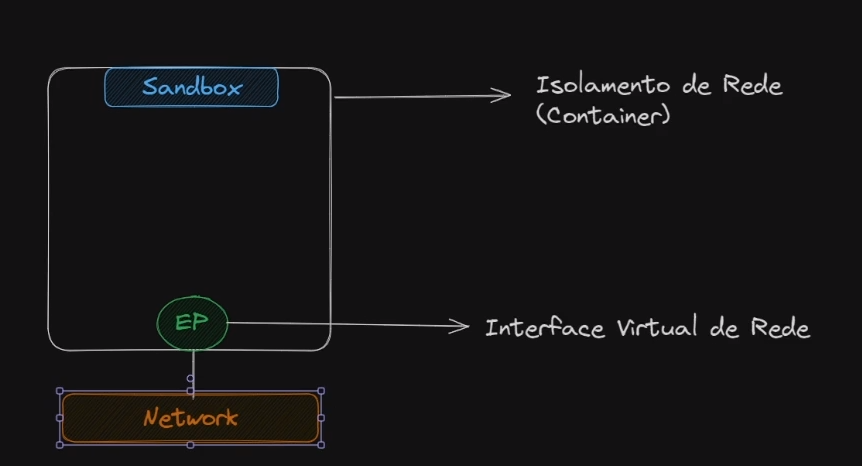

## Introdução sobre Docker Network

A Docker Network é uma funcionalidade do Docker que permite a comunicação entre os containers de uma aplicação. Ela fornece um ambiente isolado para que os containers possam se comunicar entre si, seja na mesma máquina ou em diferentes máquinas dentro de uma rede.

Com o Docker Network, é possível criar redes virtuais privadas para os containers, facilitando a comunicação e o compartilhamento de recursos entre eles. Essa funcionalidade é especialmente útil em ambientes de desenvolvimento e produção, onde é necessário manter a segurança e a eficiência da comunicação entre os componentes da aplicação.

Além disso, a Docker Network oferece suporte a diferentes tipos de drivers de rede, permitindo a configuração de redes personalizadas de acordo com as necessidades específicas de cada aplicação.

Utilizando a Docker Network, é possível criar uma infraestrutura de rede flexível e escalável para suas aplicações baseadas em containers, proporcionando um ambiente seguro e confiável para o seu sistema distribuído.

==**Obs.: Não é uma boa pratica trabalhar com IP em containers.**==

### Tipos de network:

  

[[bridge]]

---

[[host]]

---

[[none]]

---

[[macvlan]]

---

[[overlay]]

### Arquitetura:



  

---

### Comandos:

Listando rede:

```Bash
docker network ls
```

**Criando rede:**  
  

```Bash
docker network create <nome_da_rede>
```

**Conectar um container a uma rede existente:**

```Bash
docker network connect <nome_da_rede> <id_container>
OU
docker network connect <nome_da_rede> <nome_container>
```

  

**Desconectar um container a uma rede existente:**

```Bash
docker network disconnect <nome_da_rede> <id_container>
OU
docker network disconnect <nome_da_rede> <nome_container>
```

  

  

**Documentação:**

[https://github.com/moby/libnetwork/blob/master/docs/design.md](https://github.com/moby/libnetwork/blob/master/docs/design.md)

[https://github.com/moby/libnetwork](https://github.com/moby/libnetwork)

  

[[Domínio no container]]