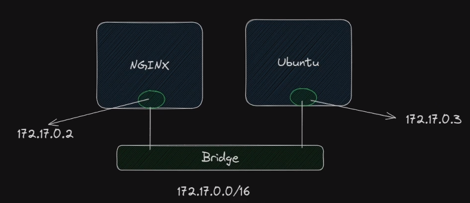

**Rede padrão(bridge):**

Ao rodar um `docker container run ubuntu` por exemplo, ele cria um container e uma placa de rede virtual, ao matar esse container e criar novamente, o `IP` irá mudar, por isso não devemos trabalhar com `IP` no container.

Neste modelo não temos isolamento.



  

### bridge

Ao criar uma rede bridge manualmente, ela conseguirá utilizar resolução de nomes(DNS) e ter o isolamento de redes, no modelo anterior só funciona via IP.

Utilizando o comando abaixo:

```Bash
docker network create minha_rede
```

Ao criar um container novo `docker container run --name nginx --network aula_docker -d nginx` e criar um com ubuntu utilizar `docker container run --name meu_ubuntu --network aula_docker -d ubuntu` .

Se rodarmos o CURL no ubuntu para o nginx usando DNS `curl` [`http://nginx`](http://nginx) teremos a resposta da pagina.


  

Por padrão o docker cria as subnets com o IP `172.18.0.0/16` cada nova rede ele incrementa a rede `172.19.0.0` ,`172.20.0.0` e assim sucessivamente.

Para resolver isso podemo usar dois parametros um para definir a subnet que queremos e o gateway.

Exemplo:

```Bash
docker network create --subnet=10.0.0.0/16 --gateway=10.0.0.1 outra_rede
```

  

### Como funciona a rede bridge?

docker0 é a rede virtual do docker padrão, se eu criar outra rede ele vai criar uma nova interface de rede.

  

_Obs.: Switch é só uma representação no diagrama, mas ali no caso cada container se conecta no switch conforme a rede que a pessoa quiser escolher._

  


  

Podemos ter container conectado a duas interfaces de rede, conforme abaixo.


  

**eno1** = interface do sistema operacional host, em alguns casos o nome é **eth0**

**docker0**= interface padrão do docker(virtual)

**br-ed6a5c73353a**= interface da nova rede criada pelo comando `docker network create minha_nova_rede`

