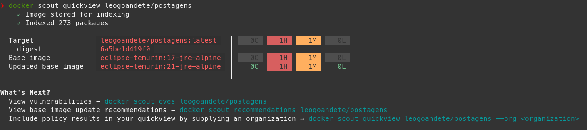
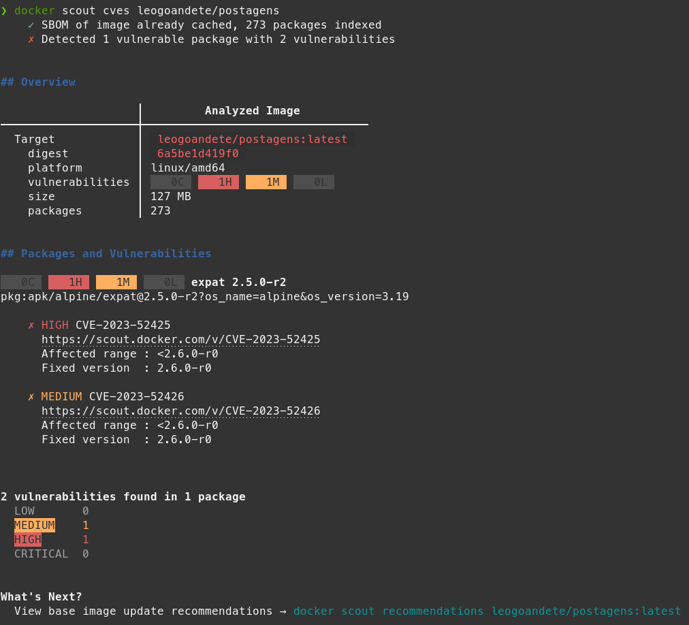

Faz a verificação de vulnerabilidades e da cadeia de construção da imagem.

Realiza o inventario de todos os pacotes.
  

Links sobre o Docker Scout:

https://www.docker.com/products/docker-scout/

https://docs.docker.com/scout/integrations/

https://github.com/docker/scout-cli


**Verificação Simples de Imagem**

Comando para verificação de imagens:

O comando abaixo ele da um overview resumido das vulnerabilidades.



```Bash
docker scout quickview <image>
```

  

**Verificando CVEs das imagens:**

Comando para informações detalhadas das CVEs.



```Bash
docker scout cves leogoandete/postagens
```


Podemos listar de formas diferentes, exemplo em Markdown:

```Bash
docker scout cves --format markdown leogoandete/postagens > vulnerabilidades.MD
```

  

Rodando consulta de CVEs no diretório corrente da imagem:

```Bash
docker scout cves fs://.
```

  

Podemos obter a recomendação de correção de vulnerabilidades com o Docker Scout:

```Bash
docker scout recommendations leogoandete/postagens
```

  

Comparando vulnerabilidades de imagens:

```Bash
docker scout compare --to <image-origem> <minha-imagem>
```

  

Listando SBOM de uma imagem:

```Bash
docker scout sbom <imagem>
docker scout sbom --format list <imagem>
```

  

O que é SBOM?

Software Bill of Materials, ou SBOM, **é um inventário completo de um aplicativo**