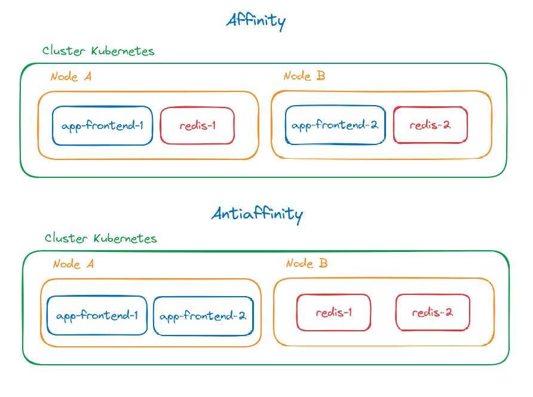

#### **Node Selector**

Podemos definir em qual nó do cluster o container vai executar fixamente através das labels.

Primeiro precisamos definir o label no nó do custer:
```bash
kubectl label node <nome-do-no> database=mongodb
```

Depois definimos no deployment do POD o `nodeSelector`:
```yaml
nodeSelector:
  database: mongodb
```

```yaml
apiVersion: apps/v1
kind: Deployment
metadata:
  name: cadastro-deployment
spec:
  replicas: 2
  selector:
    matchLabels:
      # Tem que ser o mesmo valor declarado no POD.
      app: cadastro
  template:
    metadata:
      labels:
        app: cadastro
    spec:
      nodeSelector:
        database: mongodb
      containers:
        - name: cadastro
          image: leogoandete/cadastro:latest
```

Essa definição de relacionamento de nodeSelector com o nó, pois caso o nó é excluído ou não há o nó com a definição da label o pod não vai ser criado. Ou seja perde a resiliência das informações.

---

#### **Node Affinity**

Com o Affinity podemos aplicar o mesmo conceito do Node Selector, porem vamos ter preferencia por usar um label, se ele n'ao existir ele vai criar mesmo assim o deployment.

A afinidade do nó é conceitualmente semelhante a `nodeSelector`, permitindo restringir em quais nós seu pod pode ser programado com base nos rótulos dos nós. Existem dois tipos de afinidade de nó:

- `requiredDuringSchedulingIgnoredDuringExecution`: o agendador não pode agendar o pod a menos que a regra seja atendida. Funciona como `nodeSelector`, mas com uma sintaxe mais expressiva.
- `preferredDuringSchedulingIgnoredDuringExecution`: o escalonador tenta encontrar um nó que atenda à regra. Se um nó correspondente não estiver disponível, o agendador ainda agendará o pod.

```yaml
apiVersion: v1
kind: Pod
metadata:
  name: with-node-affinity
spec:
  affinity:
    nodeAffinity:
      requiredDuringSchedulingIgnoredDuringExecution:
        nodeSelectorTerms:
        - matchExpressions:
          - key: topology.kubernetes.io/zone
            operator: In
            values:
            - antarctica-east1
            - antarctica-west1
      preferredDuringSchedulingIgnoredDuringExecution:
      - weight: 1
        preference:
          matchExpressions:
          - key: another-node-label-key
            operator: In
            values:
            - another-node-label-value
  containers:
  - name: with-node-affinity
    image: registry.k8s.io/pause:2.0
```

Mais detalhes: https://kubernetes.io/docs/concepts/scheduling-eviction/assign-pod-node/#node-affinity

---

#### **Pod Affinity e Pod Antiaffinity**

Podemos aplicar o mesmo conceito do `Node Affinity` para o PODs.
Por exemplo temos uma aplicação que usa redis, e para reduzirmos a latência o ideal é deixar o pod do redis no mesmo nó da aplicação. Com regras de afinidade `podAffinity` conseguimos esse controle. 
Podemos inclusive fazer o oposto que seria o antiafinidade `podAntiAffinity`, um exemplo é quando queremos garantir que as aplicações não fiquem no mesmo nó que os pods com redis.

Exemplo de POD `affinity` e `antiaffinity`:
```yaml
apiVersion: v1
kind: Pod
metadata:
  name: app-frontend
spec:
  affinity:
    podAffinity:
      requiredDuringSchedulingIgnoredDuringExecution:
      - labelSelector:
          matchExpressions:
          - key: app
            operator: In
            values:
            - "redis"
        topologyKey: kubernetes.io/hostname    
    podAntiAffinity:
      preferredDuringSchedulingIgnoredDuringExecution:
      - weight: 100
        podAffinityTerm:
          labelSelector:
            matchExpressions:
            - key: app
              operator: In
              values:
              - "redis"
          topologyKey: kubernetes.io/hostname
  containers:
  - name: with-pod-affinity
    image: registry.k8s.io/pause:2.0
```

No tipo de `Affinity` e `Antiaffinity` podemos ter o *required* para definir obrigatoriedade e temos o *preferred*, nele temos um peso.

No *`preferred`* ele vai tentar sempre colocar em nós distintos, caso tenha mais replicas que nós, ele vai repetir em alguns nós até atender o total de replicas definido.

No *`required`* caso o numero de replicas for maior que o numero de nós ele vai preencher de acordo com a quantidade de nós existente e o que sobrar ficara em `pending` até ter mais nós para distribuir.



No exemplo do `Affinity`  queremos que nosso frontend fique sempre com um pod do redis no mesmo nó, reduzindo a latência. Entende-se que o `app-frontend` tem afinidade com o `redis`.

No exemplo do `Antiaffinity` queremos que os pods com o frontend não fique junto com o redis. Entende-se que o `app-frontend` **NÃO** tem afinidade com o `redis`.

---
#### **Taint**

No taint podemos definir uma antiafinidade no nó, com isso ele define qual pod será executado ali. Ele define uma chave, valor e efeito.

Podemos utilizar três tipos de efeitos:
`PreferNoSchedule` para que o pod não seja preferencialmente agendado dentro do nó.

`NoSchedule` para que ele não seja agendado de forma nenhuma. 

`NoExecute` não pode ser executado. Ele é utilizado pois eu posso definir um taint depois que o pod foi agendado no nó, ele pode acabar ficando no nó e eu quero que não seja executado.

Para nos auxiliar com os `taint` temos um tolerations para colocar um exceção e o taint não passa a valer no pod definido.

Adicionando taint em um nó:
```bash
kubectl taint node <nome-do-no> <chave>=<valor>:<PreferNoSchedule|NoSchedule|NoExecute>
```

Removendo taint de um nó:
Adicionamos o sinal `-` ao final do tipo do tipo
```bash
kubectl taint node <nome-do-no> <chave>=<valor>:<PreferNoSchedule|NoSchedule|NoExecute>- 
```