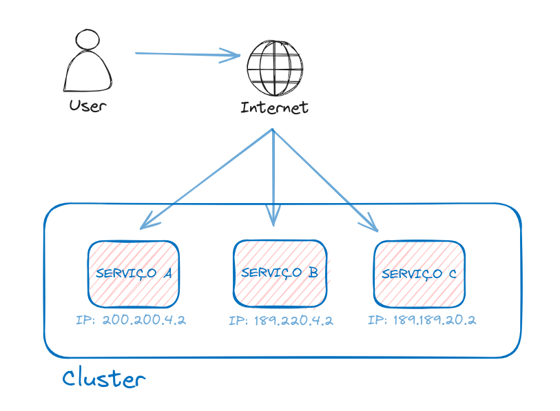
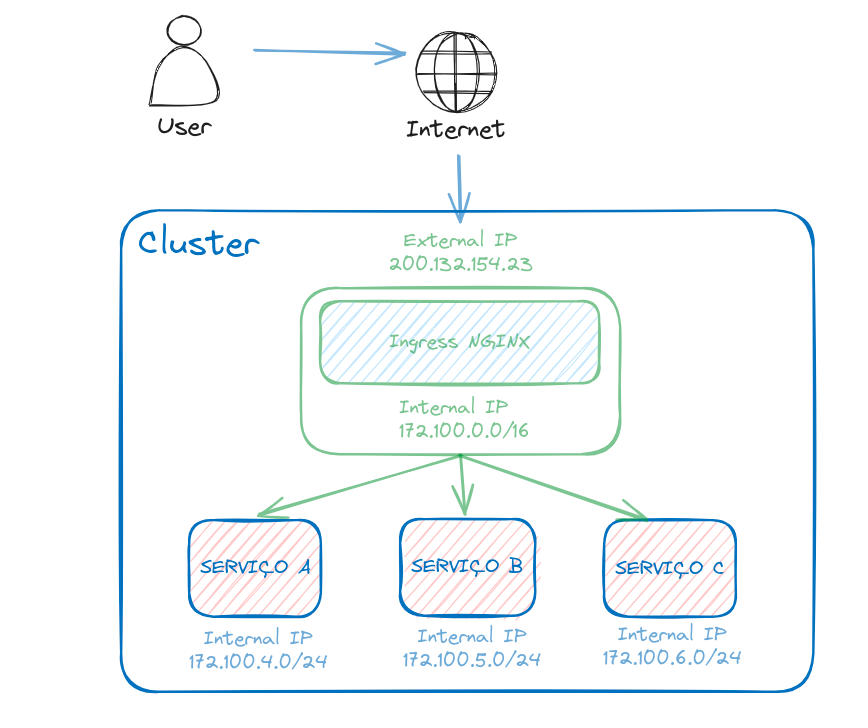

O CNI padrão do KinD não tem suporte a Network Policy, então para usar o kind, precisamos criar ele sem o CNI default, apoś a criação instalamos o CNI desejado como o WaveNet.

Exemplo de arquivo para cluster sem CNI default do KinD:

```yaml
kind: Cluster
apiVersion: kind.x-k8s.io/v1alpha4
networking:
  disableDefaultCNI: true
  podSubnet: 192.168.0.0/16
```

Instalar o CNI WaveNet:
```bash
kubectl apply -f "https://cloud.weave.works/k8s/net?k8s-version=$(kubectl version | base64 | tr -d '\n')"
```

Há vários Network Policy Provider link para outras versões:
https://kubernetes.io/docs/tasks/administer-cluster/network-policy-provider/

---

#### **NetworkPolicy**

Os PODs por padrão se comunicam sem nenhuma restrição, porem precisamos limitar essas conexões, para fazer essa garantia de controle de comunicação é utilizado o Network Policy.

Exemplo de um arquivo de NetworkPolicy:
```yaml
apiVersion: networking.k8s.io/v1
kind: NetworkPolicy
metadata:
  name: nginx-policy
spec:
  podSelector:
    matchLabels:
      app: teste
  policyTypes:
  - Ingress
  - Egress
  ingress:
  - from:
      - podSelector:
          matchLabels:
            app: teste-cliente
    ports:
      - protocol: TCP
        port: 80
  
  egress:
  - to:
      - podSelector:
          matchLabels:
            app: teste-cliente
    ports:
    - protocol: TCP
      port: 80
```

No exemplo acima todos os pods com a label `app: teste` vão ter regras de entrada e saída para a porta 80.

Na `spec` da policy definimos que tanto trafego de entrada e saída na porta 80 só vai ocorrer com pod que tiver com label `teste-cliente`.

Para validar podemos executar abaixo os seguintes comandos: 
Sem acesso, deverá dar time-out:
```bash
kubectl run -i --tty --image kubedevio/ubuntu-curl ping-test --restart=Never --rm -- curl http://nginx
```

Com acesso, deverá carregar a pagina do NGINX:
```bash
kubectl run -i --tty -l app=teste-cliente --image kubedevio/ubuntu-curl ping-test --restart=Never --rm -- curl http://nginx
```

Podemos aplicar bloqueios por `namespaces` e por range de ip, mais informações:
https://kubernetes.io/docs/concepts/services-networking/network-policies/

---

#### **ServiceAccount e RBAC**

Assim como conectamos nós acessamos o cluster Kubernetes, temos os nossos acessos e permissões. Os PODs também utilizam da mesma forma, porem ele não utiliza a nossa conta, ele utiliza uma conta própria que é chamada de `Service Account` e ele também necessita de permissões. Geralmente quando se precisa de adição de alguns acessos. 


É uma boa prática, criamos uma `ServiceAccount` com o minimo de permissão possível, garantindo segurança dentro do cluster, isto precisa ser muito bem refinado, e para isso existe o `RBAC`, é uma regra para o cluster baseado em `Roles` e `Role Bindings`, a `Role` tem acessos e o ***Binding*** é o que liga uma `Role` a uma `Service Account`.

Neste projeto temos uma API que exibe a listagem de Deployments, PODs e Service:
https://github.com/KubeDev/k8s-dashboard-csharp

Para isso precisamos criar as permissões necessárias.

Criar uma conta de usuário para a aplicação:
```yaml
apiVersion: v1
kind: ServiceAccount
metadata:
  name: user-dashboard
```

Criar as roles necessarias:
```yaml
apiVersion: rbac.authorization.k8s.io/v1
kind: ClusterRole
metadata:
  name: dashboard-reader
rules:
- apiGroups: [""]
  resources: ["namespaces", "pods", "services"]
  verbs: ["get", "watch", "list"]
```

Por fim precisamos vincular a `Role` com a `ServiceAccount` para isso precisamos do `RoleBinding`:

```yaml
apiVersion: rbac.authorization.k8s.io/v1
kind: ClusterRoleBinding
metadata:
  name: dashboard-reader-bind
subjects:
- kind: ServiceAccount
  name: user-dashboard
  namespace: default
roleRef:
  kind: ClusterRole
  name: dashboard-reader
  apiGroup: rbac.authorization.k8s.io  
```

Após é necessário vincular a `serviceAccount` no `Deployment` na sessão `spec` do template:
```yaml
apiVersion: apps/v1
kind: Deployment
metadata:
  name: k8s-dashboard-deploy
spec:  
  selector:
    matchLabels:
      app: k8s-dashboard
  template:
    metadata:
      labels:
        app: k8s-dashboard
    spec:
      serviceAccount: user-dashboard
      containers:
      - name: k8s-dashboard
        image: kubedevio/k8s-dashboard
        imagePullPolicy: Always
```

---
#### **Ingress Controller**

O Ingress controller nos auxilia a realizar a exposição de nossos serviços executados no cluster. Se fossemos usar o tipo LoadBalancer eu teria que ter um IP para cada serviço o que geraria muito custo, para resolver isso temos o Ingress que utiliza uma unica entrada e direciona para os serviços internos do cluster de acordo com as regras.

Exemplo com IP externo para cada serviço:
Nesse exemplo eu teria que comprar um nome de domínio para cada serviço.



Exemplo usando Ingress:
Neste caso compramos somente um domínio e pode ser utilizado a estrategia de wildcard.

O Ingress NGINX tera um service do tipo LoadBalancer.
O Ingress Controller sempre consulta um Ingress para ver para quem será redirecionado.
Podemos ter mais de um Ingress Controller no cluster.

Exemplo: ServicoX.meudominio.com
         \*.meudominio.com



Para configurar um Ingress Controle, primeiro precisamos intalar ele no cluster, ha varios tipos de Ingress Controller como o NGINX, Kong, HAProxxy. 

Neste exemplo vamos usar o NGINX, para instalar basta seguir a documentação https://kubernetes.github.io/ingress-nginx/deploy/ , tomar cuidado pois há a documentação do NGINX e a documentação do Kubernetes.

Vamos usar a opção de Bare Metal por ser um cluster local: 

Fornecido na documentação do Kubernetes para NGINX:
```bash
kubectl apply -f https://raw.githubusercontent.com/kubernetes/ingress-nginx/controller-v1.10.1/deploy/static/provider/baremetal/deploy.yaml
```

Fornecido na documentação do Kind:
```bash
kubectl apply -f https://raw.githubusercontent.com/kubernetes/ingress-nginx/main/deploy/static/provider/kind/deploy.yaml
```

Criando um Ingress para o serviço baseado em path:

```yaml
apiVersion: networking.k8s.io/v1
kind: Ingress
metadata:
  name: ingress-simples
spec:
  rules:
  - http:
      paths:
      - pathType: Prefix
        path: /
        backend:
          service:
            name: foo-service
            port:
              number: 8080
```

