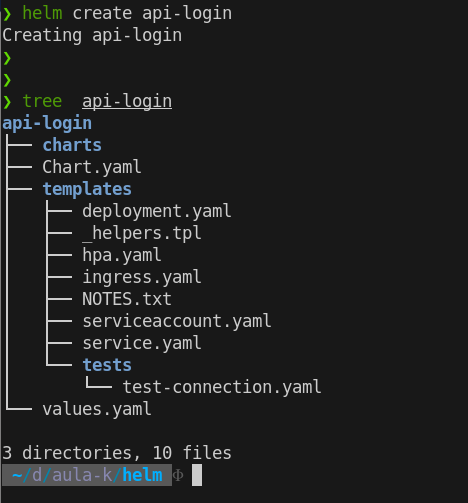

O Helm lhe auxilia no gerenciamento de aplicações para Kubernetes — Charts do Helm ajudam a definir, instalar, e atualizar até a mais complexa aplicação para o Kubernetes.

O deploy no Kubernetes é bem complexo e podemos acabar esquecendo algum arquivo para aplicar/configurar .

Para isso temos um gerenciador de pacotes, similar com o apt, o helm ele é baseado em templates, que é chamado de charms.

Ele funciona com uma ferramenta CLI, e a partir dela criamos algum charts, aplicar algum chats. Sempre utilizamos algum repositório para escolher as ferramentas.

Toda instalação de um chart é uma release.

### **Instalação**

Link: https://helm.sh/docs/intro/install/

### **Manipulando repositórios**

Adicionando repositório: 
```bash
helm repo add stable https://charts.helm.sh/stable
```

Atualizando lista de pacotes:
```bash
helm repo update
```

Listando repositórios:
```bash
helm repo list
```

Removendo repositórios:
```bash
helm repo remove <nome-repositorio>
```

---
### ** Instalando aplicações**

Instalando o helm para instalar o nginx ingress controller.
```bash
helm repo add ingress-nginx https://kubernetes.github.io/ingress-nginx
```

Podemos executar um `inspect` para ver as informações do helm.

```bash
helm inspect all ingress-nginx/ingress-nginx
```

Podemos ver somente os `values` de um chart:

```bash
helm inspect values ingress-nginx/ingress-nginx
```

Instalando de fato o chart:
```bash
helm install <nome-release> ingress-nginx/ingress-nginx

# Em um namespace especifico:
helm install <nome-release> ingress-nginx/ingress-nginx --namespace <nome-namespace>
```

Output de saída da instalação de uma release:


Desinstalando uma release:
```bash
helm uninstall <nome-release>
# Em um namespace especifico:
helm uninstall <nome-release> --namespace <nome-namespace>
```

Output: 
```bash
release <nome-releasse> uninstalled
```

Atualizando uma release:
```bash
helm upgrade <nome-release> ingress-nginx/ingress-nginx --values <caminho-do-arquivo>

# Em um namespace especifico:
helm upgrade <nome-release> ingress-nginx/ingress-nginx --values <caminho-do-arquivo> --namespace <nome-namespace>
```

Visualizar histórico de uma release: 
```
helm history <nome-release>

# Em um namespace especifico:
helm history <nome-release> --namespace <nome-namespace>
```

Podemos fazer um rollback, ou seja voltar a versão anterior:
```bash
helm rollback <nome-release>

# Em um namespace especifico:
helm rollback <nome-release> --namespace <nome-namespace>
```

---
### **Primeiro Helm Chart**

Exemplos de Charts: https://github.com/bitnami/charts/tree/main/bitnami

Para criarmos um template de Helm, executamos o comando 
```bash
helm create <nome-chart>
```

Ele irá criar uma pasta com o nome definido no `create`:



---
#### **Criando um template de mongo usando helm:**

Criar o arquivo abaixo com o nome desejado porem ele deverá estar dentro da pasta "Templates".
Pode ser criado vários arquivos separados, para criar os objetos no cluster, como service, hpa entre outros.

``` yaml
apiVersion: apps/v1
kind: Deployment
metadata:
  name: {{ .Release.Name }}-mongodb-deployment
spec:
  selector:
    matchLabels:
      # Tem que ser o mesmo valor declarado no POD.
      app: {{ .Release.Name }}
  template:
    metadata:
      labels:
        app: {{ .Release.Name }}
    spec:
      containers:
        - name: {{ .Release.Name }}-container
          image: mongodb:{{ .Values.mongodb.tag }}
          ports:
          - containerPort: 27017
          env:
          - name: QUARKUS_DATASOURCE_USERNAME
            value: {{ .Values.mongodb.credenciais.userName }}
          - name: QUARKUS_DATASOURCE_PASSWORD
            value: {{ .Values.mongodb.credenciais.userPassword }}
```

Adicionar no arquivo `values.yml` os valores.

``` yaml
mongodb:
  tag: 4.2.8
  credenciais:
    userName: "meu_usuario"
    userPassword: "minha_senha"
```

Após os ajustes acima para validarmos se será criado os objetos corretamente sem executar no cluster pode ser usado o comando abaixo:

```bash
helm install <nome-desejado> ./<diretorio-templates> --dry-run --debug

#Com output para um arquivo
helm install <nome-desejado> ./<diretorio-templates> --dry-run --debug > arquivo.yml
```

Para instalar podemos rodar o comando:
Lembrando que o deployment ficara com o nome passado que foi definido \<nome-desejado> 

```bash
helm install <nome-desejado> <diretorio-helm> 
```

---
#### **Estrutura if/else**

Podemos utilizar operadores condicionais no template.

```yaml
apiVersion: v1
kind: Secret
metadata:
  name: {{ .release.Name }}-mongodb-secret
type: Opaque
data:
  MONGO_INITDB_ROOT_USERNAME: {{ .Values.mongodb.credentials.userName | b64enc | quote }}
  MONGO_INITDB_ROOT_PASSWORD: {{ .Values.mongodb.credentials.userPassword | b64enc | quote }}
```

Por exemplo se já existir a secret acima, podemos ignorar a criação de uma secret ou definir uma escolha em um deployment por exemplo.

Para usar a estrutura é básica conforme exemplo abaixo:
Lembrando que esse valor tem que estar cadastrado no chart `.Values.mongodb.existSecret`

```yaml
{{- if empty .Values.mongodb.existSecret }}
 # Se a secret não existir executa o que tem no bloco
 - secretRef:
     name: {{ .Release.Name }}--mongodb-secret
{{- else }}
  # Se a secret exitir utiliza ela
  - secretRef:
     name: {{ .Release.Name }}--mongodb-secret
{{- end }}
```

Posso utilizar na criação de objeto também por exemplo se já existir a secret então não preciso criar, basta fazer como no exemplo abaixo:

Lembrando que esse valor tem que estar cadastrado no chart `.Values.mongodb.existSecret`

Arquivo `values.yml`:
```yaml
mongodb:
  tag: 4.2.8
  credentials:
    userName: mongouser
    userPassword: mongopass
  databaseName: admin
```

```yaml
{{- if empty .Values.mongodb.existSecret }}
apiVersion: v1
kind: Secret
metadata:
  name: {{ .Release.Name }}-mongodb-secret
type: Opaque
data:
  MONGO_INIT_ROOT_USERNAME: {{ .Values.mongodb.credentials.userName | b64enc | quote }}
  MONGO_INIT_ROOT_PASSWORD: {{ .Values.mongodb.credentials.userPassword | b64enc | quote }}
{{- end }}
```

---
#### **Estrutura loop**

Para usar estrutura de repetição podemos configurar conforme exemplo abaixo em um Ingress.

Arquivo values.yml
```yaml
api:
  image: nginx
  serviceType: ClusterIP
  ingress:
    - meudominio.com
    - outro-dominio.com.br
```


```yaml
apiVersion: networking.k8s.io/v1/beta1
kind: Ingress
metadata:
  name: {{ .Release.Name }}-api-ingress
spec:
  rules:
  {{- range .Values.api.ingress }}
  - host: {{ . }} # Usa o contexto do for
    http:
      paths:
      - backend:
		  servicePort: 80
          serviceName: {{ $.Release.Name }}-api-service #Pega fora do contexto do for
  {{- end }}        
```

---
#### **Named Templates**

Utilizado bastante em valores onde há muita repetição de valores por exemplo o nome:
`{{ .Release.Name }}-mongo-service` ou seja podemos criar um template para definir esse valor e evitar erros por repetição de valor.

Para criar esses templates auxiliares, precisamos criar um arquivo sempre com o underline na frente do nome do arquivo exemplo `_meutemplate.tpl`.

Arquivo `_meutemplate.tpl`:
```tpl
{{/* Nome do configmap */}}
{{- define "mongodb.serviceName" -}}
{{ .Release.Name }}-mongo-service
{{ - end -}}
```

Utilizando no template.
```
apiVersion: v1
kind: ConfigMap
metadata:
  name: {{ .Release.Name }}-api-configmap
data:
  Mongo__Host: {{ template "mongodb.ServiceName" . }}
  Mongo__DataBase: {{ .Values.mongodb.databaseName }}
```

---

#### **Dependência de Charts**

Quando utilizamos um Chart de uma api, mas e se minha api precisar de um banco, e já exista um Chart de um banco já criado, podemos reaproveitar toda a estrutura dele.

Primeiro precisamos definir que o nosso Chart terá uma dependência, para isso editaremos o arquivo `Chart.yml`

```yaml
...
dependencies:
  - name: mongodb
    version: "8.0.1"
    repository: "https://charts.bitnami.com/bitnami"
```

Para declarar os valores dessa dependencia, precisamos ajustar no arquivo `values.yaml` e utilizar o mesmo nome conforme abaixo:

```yaml
mongodb:
  auth:
    rootPassword: mongoRoot
    username:mongouser
    password: mongopwd
    database: produto
  persistence:
    enable: false
```

Obs.: Verificar os valores na documentação do chart.
Exemplo do mongo: https://github.com/bitnami/charts/tree/main/bitnami/mongodb

Apos os passos anteriores basta configurar o restante dos helm para a api utilizar o novo mongo e depois precisamos executar um comando para o helm pegar as dependências necessárias:

```bash
helm dependency build
```