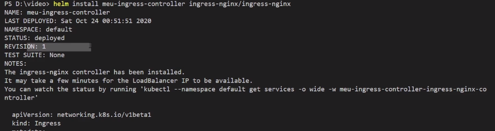

O Helm lhe auxilia no gerenciamento de aplicações para Kubernetes — Charts do Helm ajudam a definir, instalar, e atualizar até a mais complexa aplicação para o Kubernetes.

O deploy no Kubernetes é bem complexo e podemos acabar esquecendo algum arquivo para aplicar/configurar .

Para isso temos um gerenciador de pacotes, similar com o apt, o helm ele é baseado em templates, que é chamado de charms.

Ele funciona com uma ferramenta CLI, e a partir dela criamos algum charts, aplicar algum chats. Sempre utilizamos algum repositório para escolher as ferramentas.

Toda instalação de um chart é uma release.

### **Instalação**

Link: https://helm.sh/docs/intro/install/

### **Manipulando repositórios**

Adicionando repositório: 
```bash
helm repo add stable https://charts.helm.sh/stable
```

Atualizando lista de pacotes:
```bash
helm repo update
```

Listando repositórios:
```bash
helm repo list
```

Removendo repositórios:
```bash
helm repo remove <nome-repositorio>
```


### ** Instalando aplicações**

Instalando o helm para instalar o nginx ingress controller.
```bash
helm repo add ingress-nginx https://kubernetes.github.io/ingress-nginx
```

Podemos executar um `inspect` para ver as informações do helm.

```bash
helm inspect all ingress-nginx/ingress-nginx
```

Podemos ver somente os `values` de um chart:

```bash
helm inspect values ingress-nginx/ingress-nginx
```

Instalando de fato o chart:
```bash
helm install <nome-release> ingress-nginx/ingress-nginx

# Em um namespace especifico:
helm install <nome-release> ingress-nginx/ingress-nginx --namespace <nome-namespace>
```

Output de saída da instalação de uma release:



Desinstalando uma release:
```bash
helm uninstall <nome-release>
# Em um namespace especifico:
helm uninstall <nome-release> --namespace <nome-namespace>
```

Output: 
```bash
release <nome-releasse> uninstalled
```

