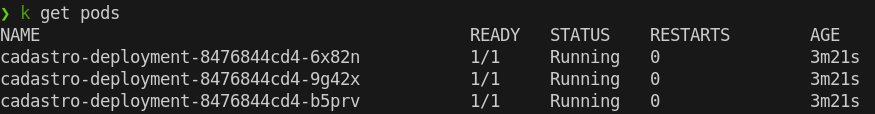
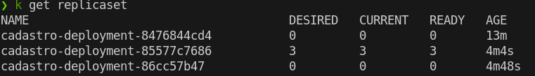
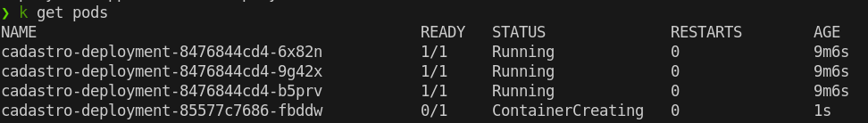
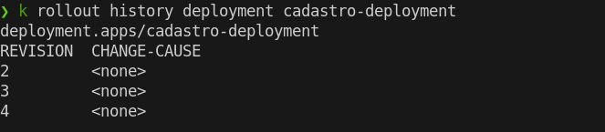

O Deployment é responsável por gerenciar o ReplicaSet. 

Podemos perceber que temos uma cascata:


Para criarmos um Deployment utilizamos a estrutura abaixo:
Perceba que a estrutura do Deployment é identica ao ReplicaSet, só altera o kind. Isso ocorre pois o deployment intrinsecamente vai criar um ReplicaSet.
``` yaml
apiVersion: apps/v1
kind: Deployment
metadata:
  name: cadastro-deployment
spec:
  selector:
    matchLabels:
      # Tem que ser o mesmo valor declarado no POD.
      app: cadastro
  template:
    metadata:
      labels:
        app: cadastro
    spec:
      containers:
      # Abaixo é utilizado as mesmas informações declarado para criar um pod manualmente.
        - name: cadastro-container
          image: leogoandete/cadastro:latest  # Substitua com a imagem do seu contêiner
          ports:
          - containerPort: 8080
          env:
          - name: QUARKUS_DATASOURCE_USERNAME
            value: "user"
          - name: QUARKUS_DATASOURCE_PASSWORD
            value: "password"
          - name: QUARKUS_DATASOURCE_DB_KIND
            value: "mysql"
          - name: QUARKUS_DATASOURCE_JDBC_URL
            value: "jdbc:mysql://mysql-service:3306/cadastro"

```

Agora podemos alterar a imagem ou algum valor no Deployment e ele irá criar novos pods.

Podemos identificar quando os pods estão com versões diferentes, pois ele adiciona um hash ao final: 



A identificação da versão do deployment pode ser observado aqui:
cadastro-deployment-8476844cd4

Se realizarmos a alteração no deployment e aplicarmos, o hash 8476844cd4 será diferente.
Ele irá "excluir" os pods antigos e aplicar novos pods com o novo hash.

Ele realiza uma exclusão lógica, se listarmos os ReplicaSet, ele mantem a versão antiga porem ele define com 0 replicas.




No exemplo abaixo forcei o restart de um deployment para criar novos pods, abaixo percebemos a mudança do hash:

```bash
kubectl rollout restart deployment cadastro-deployment
```



Podemos ver o histórico de versões e podemos fazer rollback do pod.

**Listando histórico:**

```bash
kubectl rollout history deployment <nome-deployment>
```



**Fazendo rollback:**

```bash
kubectl rollout undo deployment <nome-deployment>
```

