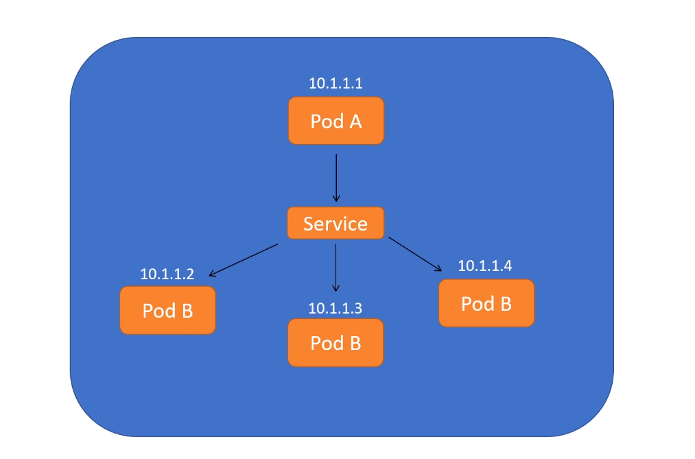
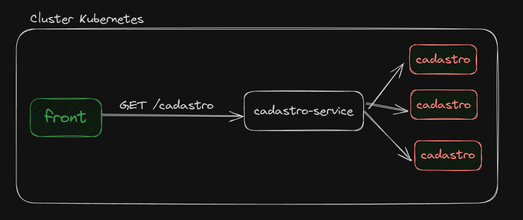

No momento não conseguimos acessar o POD, sem o uso do port-foward, temos o problema que os pods são efêmeros então sempre os IPs irão mudar, para isso temos um objeto chamado Services.

O service discovery é utilizado  como ponto único onde os pods são registrado, dessa forma nunca vamos acessar diretamente ao POD.

Vamos acessar o service discovery, ele vai fornecer um IP de algum pod para acesso ele também realiza o balanceamento de carga.

Possuímos diversos tipos de services, veremos a seguir.


### **ClusterIP**

O ClusterIP serve para gerar conexão entre pods dentro do cluster, não haverá conexão externa.



Neste exemplo, o POD A, precisa acessar o POD B, porem não será acessado diretamente, desta forma é criado o service do tipo ClusterIP e o POD A acessará algum POD B através do service.

Exemplo de um service:

```yml
apiVersion: v1
kind: Service
metadata:
  name: cadastro-service
spec:
  selector:
    app: cadastro # Utilizar o mesmo definido no Label do pod.
  ports:
    - protocol: TCP
      port: 8083 # porta do service
      targetPort: 8080 #porta do pod
  type: ClusterIP # Se eu não definir o type o default é ClusterIP.

```


No exemplo abaixo o front se comunica com as api de cadastro através do cadastro-service internamente dentro do cluster.



