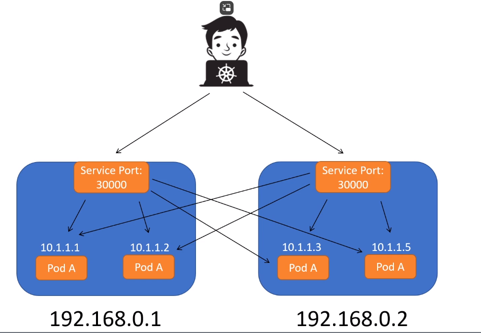
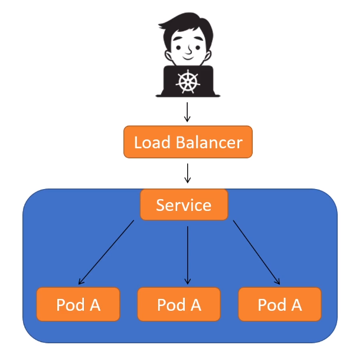
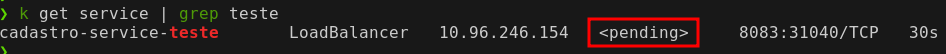
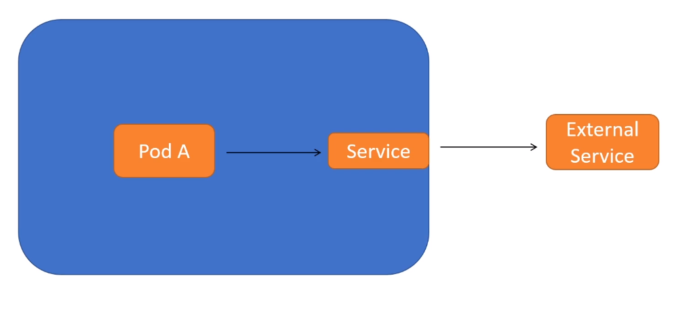

No momento não conseguimos acessar o POD, sem o uso do port-foward, temos o problema que os pods são efêmeros então sempre os IPs irão mudar, para isso temos um objeto chamado Services.

O service discovery é utilizado  como ponto único onde os pods são registrado, dessa forma nunca vamos acessar diretamente ao POD.

Vamos acessar o service discovery, ele vai fornecer um IP de algum pod para acesso ele também realiza o balanceamento de carga.

Possuímos diversos tipos de services, veremos a seguir.

---
### **ClusterIP**

O ClusterIP serve para gerar conexão entre pods dentro do cluster, não haverá conexão externa.


Neste exemplo, o POD A, precisa acessar o POD B, porem não será acessado diretamente, desta forma é criado o service do tipo ClusterIP e o POD A acessará algum POD B através do service.

Exemplo de um service usando ClusterIP:

```yml
apiVersion: v1
kind: Service
metadata:
  name: cadastro-service
spec:
  selector:
    app: cadastro # Utilizar o mesmo definido no Label do pod.
  ports:
    - protocol: TCP
      port: 8083 # porta do service
      targetPort: 8080 #porta do pod
  type: ClusterIP # Se eu não definir o type o default é ClusterIP.

```


No exemplo abaixo o front se comunica com as api de cadastro através do cadastro-service internamente dentro do cluster.


---
### **NodePort**

O Service do tipo NodePort gera uma comunicação externa, porem o acesso aos pods é feito por uma porta do cluster kubernetes.
O range de portas liberadas é 30000-32777, então ele escolhe uma porta destas e faz o bind com os pods.

Neste caso vamos utilizar os IPs do cluster do kube. Se o pod não estiver rodando no nós do cluster escolhido o kube proxy fará o redirecionamento correto.



Exemplo de um service usando NodePort:

```yml
apiVersion: v1
kind: Service
metadata:
  name: cadastro-service-teste
spec:
  selector:
    app: cadastro # Utilizar o mesmo definido no Label do pod.
  ports:
    - protocol: TCP
      port: 8083 # porta do service
      targetPort: 8080 #porta do pod
  type: NodePort # Se eu não definir o type o default é ClusterIP.

```

Para acessar basta pegar o IP de um dos nós do kubernetes e obter a porta.

![[exemplo-curl-nodeport.png]]

```bash
curl http://172.19.0.2:30291/q/health
```

---
### **LoadBalancer**

O Service do tipo LoadBalancer também gera uma comunicação externa, porem é utilizado o serviço de provedor de nuvem para fornecer um IP para acessar o serviço.



Exemplo de um service usando LoadBalancer:
Obs.: Esse tipo é somente para serviço em nuvem ou on-promisse que forneça um IP.
```yml
apiVersion: v1
kind: Service
metadata:
  name: cadastro-service-teste
spec:
  selector:
    app: cadastro # Utilizar o mesmo definido no Label do pod.
  ports:
    - protocol: TCP
      port: 8083 # porta do service
      targetPort: 8080 #porta do pod
  type: LoadBalancer # Se eu não definir o type o default é ClusterIP.
```

Ao aplicar o arquivo no kubernetes local como o Kind, ele ficará em `pending`



---
### **ExternalName**

O tipo ExternalName funciona de um formato oposto, ou seja será um service para acessar recursos externos de forma padronizada. Sempre o pod necessitar o acesso externamente nunca será direto, sera usado o service.

Nesse formato não necessito alterar um deployment para trocar um IP do serviço externo por exemplo.



Exemplo de um service usando LoadBalancer:

```yaml
apiVersion: v1
kind: Service
metadata:
  name: exemplo-service
spec:
  type: ExternalName
  externalName: meu-servico-externo.com
```

Ao executarmos o curl dentro do pod, devemos ter o mesmo resultado ao acessar a pagina no navegador por exemplo.

Obs.: Lembrar que a url é utilizando o nome do service.

```bash
curl http://exemplo-service/api/v2
```