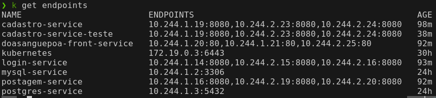

Cada vez que é criado um service, o kubernetes cria automaticamente um objeto Endpoint com o nome do service e os pods que estão vinculados a ele.

Podemos visualizar os endpoints usando o comando:
```bash
kubectl get endpoints
```

E teremos o resultado abaixo, na coluna ENDPOINTS temos os IPs dos pods que estão rodando de forma estável.


Para ter mais detalhes, podemos dar um describe usando o nome do service.