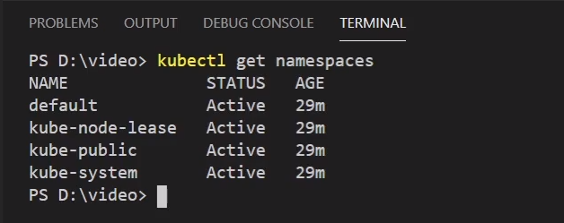

### **Utilizando Namespace**

Namespace é um minicluster dentro do kubernetes, isso da flexibilidades e separação de ambientes, podemos ter separação por aplicação e limitação de recursos.

O kubernetes vem com alguns namespace já existente por default.



`default` é o namespace padrão, para objetos sem definição de namespace

`kube-system` para objetos de sistema do cluster kubernetes 

`kube-public` utilizado para acesso publico

`kube-node-lease` objetos associado a cada nó do cluster kubernetes, para verificar status e saúde dos nós.

Podemos criar `namespace`, por exemplo um namespace para banco de dados.
```bash
kubectl create namespace database
```

Para aplicar recursos no namespace desejado, basta adicionar o `-n <nome-namespace>` nos comandos do kubectl.
Exemplo:
```bash
# Aplicar recurso
kubectl apply -f <manifesto>.yml -n <nome-namespace>

#Listar recurso
kubectl get pods -n <nome-namespace>

#listar de todos os namespaces
kubectl get pods --all-namespaces
```

Podemos adicionar no `metadata` dos manifestos de cada arquivo. O ideal é utilizar no comando pois não precisa alterar cada arquivo.
```yaml
apiVersion: v1
kind: Service
metadata:
  namespace: meu-namespace
  name: cadastro-service-teste
```

---
### **Comunicação entre Namespaces**

Configuração para comunicação de pods em diferentes namespaces.

Para fazer a comunicacao com services em diferentes namespaces, devemos utilizar o nome completo do DNS.

Exemplo.:
```bash
curl http://cadastro-service.<nome-namespace>.svc.cluster.local
```

Podemos simplificar utilizando o service do tipo ExternalName no namespace `default`:
```yaml
apiVersion: v1
kind: Service
metadata:
  name: exemplo-service-namespace
spec:
  type: ExternalName
  externalName: cadastro-service.<nome-namespace>.svc.cluster.local
```

```bash
curl http://exemplo-service-namespace
```

---
### **O que é separado por namespace e o que não é?**

Nem todos os objetos é separado por namespaces, para isso podemos verificar através de um comando:

```bash
kubectl api-resources --namespaced=true
```

Com o `true` ele gera uma lista de todos os recursos que podem ser separados por namespace, se alterarmos para `false` ele vai exibir o que não pode ser separado.