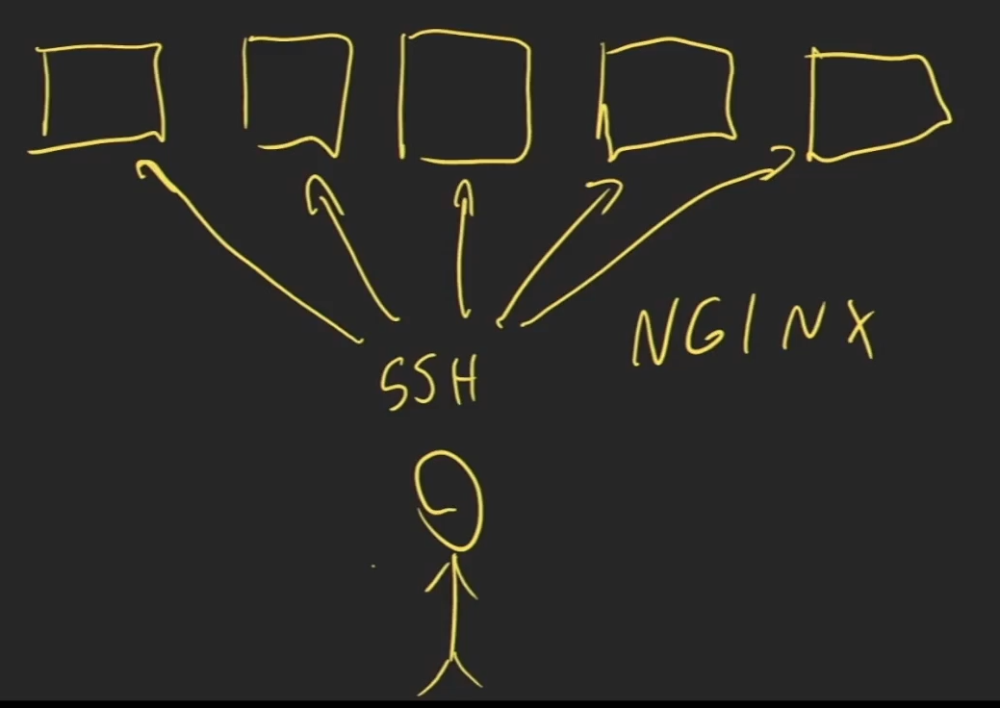
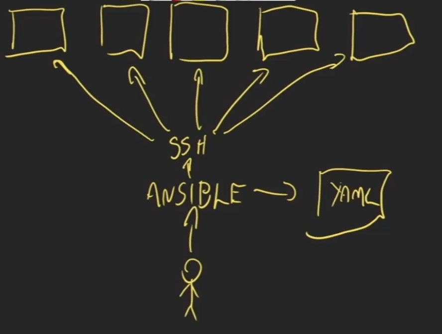
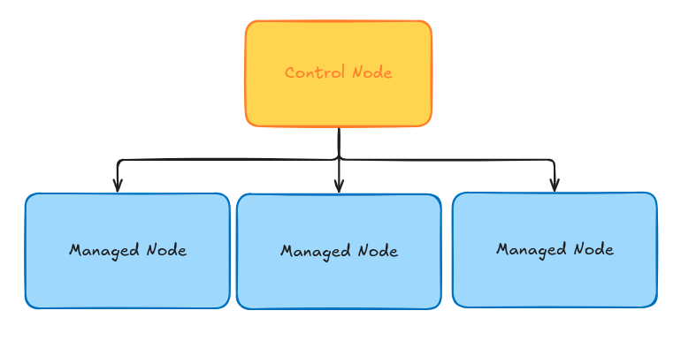

## **Ansible**
### O que é o Ansible?

É um projeto open source escrita em python e desenvolvida pela Red Hat, ele é utilizado como uma ferramente para infraestrutura como codigo (IaC)
para gerenciamento de configuração. Pode ser utilizado tanto em infraestrutura local como em nuvem, a sua sintaxe é simples pois utiliza a estrutura `yaml`.

Obs.: O Ansible ele trabalha com configuração, ou seja, em uma infraestrutura já existente, diferente do Terraform que cria a infraestrutura. Porem os dois podem trabalhar de forma complementar.

### Funcionamento
> Como seria sem o ansible?

Sem o ansible teriamos que instalar manualmente um serviço em cada máquina e validar sua configuração, conforme imagem abaixo.

> E como o Ansible pode nos ajudar?

Simples, ele irá entrar como um intermediario entre os host e o usuario, e aplicando a configuração baseado em um ou vários templates `yaml`.

## **Estrutura do Ansible**

## Control Node
Será a máquina que irá aplicar a configuração, elá é a origem ou seja a máquina que fazer o gerenciamento, e será a máquina que terá o `ansible` instalado. 

## Managed Node 
Será as maquinas que receberá as alterações, vindas do `Control Node`.

## Inventário
Será o arquivo com a lista de máquinas que será aplicado a configuração. Poderá ser separado por grupo de configurações e agrupamento.

## Modulos 
É um bloco de código que executa uma instrução ou comando. Podemos fazer os nossos próprios modulos.

## Task

Definição de um modulo para executar uma ação.

## Play
O conjunto de `tasks`, com sua ordem definida e o setup.

## Playbook
É o conjunto de um ou mais plays.