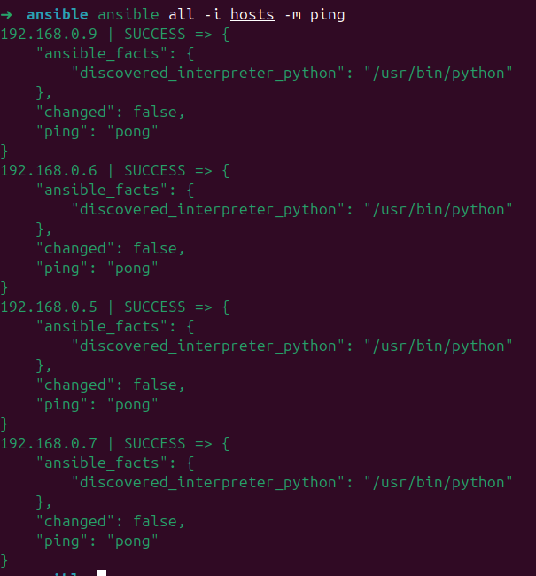
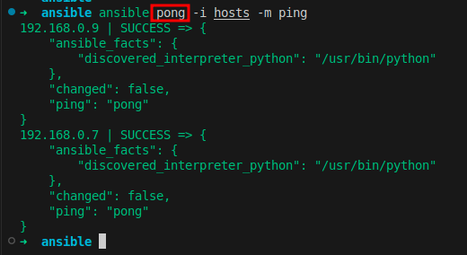
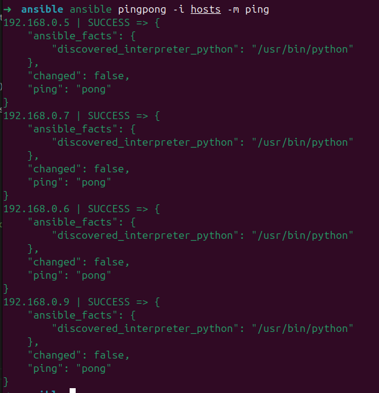

### Ansible Inventory

O inventário do ansible é basicamente uma lista das máquinas onde irá ser utilizado no projeto, e a config irá interagir.

Podemos fazer agrupamentos por maquinas, definir configurações para grupos.

O Inventario pode ser do padrão `.ini`ou `.yaml`.

O caminho padrão para os inventários é o `/etc/ansible/hosts` ou pdo ser passado com a flag `-i` no comando.

## **Criando o seu Inventário.**

Criar o arquivo `hosts` e adicionar o conteudo:

```ini
[ping] # Define o agrupamento das maquinas
192.168.0.5 ansible_user=vagrant ansible_ssh_private_key_file=~/.ssh/aula
192.168.0.6 ansible_user=vagrant ansible_ssh_private_key_file=~/.ssh/aula
192.168.0.7 ansible_user=vagrant ansible_ssh_private_key_file=~/.ssh/aula
192.168.0.9 ansible_user=vagrant ansible_ssh_private_key_file=~/.ssh/aula
```

Após executar o comando:
```bash
ansible all -i hosts -m ping
```

Veremos a saida abaixo:


## **Utilizando grupos**
O parametro `all` indica os grupos que vamos aplicar as configurações, por exemplo ao alterarmos o arquivo `hosts` para utilizar 2 grupos, o ping e o pong:

```ini
[ping] # Define o agrupamento ping
192.168.0.5 ansible_user=vagrant ansible_ssh_private_key_file=~/.ssh/aula
192.168.0.6 ansible_user=vagrant ansible_ssh_private_key_file=~/.ssh/aula
[pong] # Define o agrupamento pong
192.168.0.7 ansible_user=vagrant ansible_ssh_private_key_file=~/.ssh/aula
192.168.0.9 ansible_user=vagrant ansible_ssh_private_key_file=~/.ssh/aula
```

E se executarmos os comando alterando o `all` para o `pong` por exemplo, devemos ver a saida das maquinas pertecente ao grupo `pong`.
Exemplo: 
```bash
ansible pong -i hosts -m ping
```



Podemos fazer um agrupamento pai que contenhas seus filhos conforme ajuste no arquivo `hosts` abaixo:

```ini
[ping] # Define o agrupamento ping
192.168.0.5 ansible_user=vagrant ansible_ssh_private_key_file=~/.ssh/aula
192.168.0.6 ansible_user=vagrant ansible_ssh_private_key_file=~/.ssh/aula
[pong] # Define o agrupamento pong
192.168.0.7 ansible_user=vagrant ansible_ssh_private_key_file=~/.ssh/aula
192.168.0.9 ansible_user=vagrant ansible_ssh_private_key_file=~/.ssh/aula
[pingpong:children] # Define o grupo com filhos
pong # Filho do grupo pingpong
ping # Filho do grupo pingpong
```

## **Inventário com subgrupo.**

Agora se alterarmos o comando para utilizar o grupo `pingpong` com os subgrupos `ping` e `pong`.

Exemplo: 
```bash
ansible pingpong -i hosts -m ping
```

Veremos a saida abaixo:



## **Utilizando variáveis.**

Podemos criar grupo de configurações para atributos repetitivos.

``ìni
[ping] # Define o agrupamento ping
192.168.0.5 
192.168.0.6
[pong] # Define o agrupamento pong
192.168.0.7
192.168.0.9
[ping:vars] # Define o grupo com filhos
ansible_user=vagrant
ansible_ssh_private_key_file=~/.ssh/aula
```
