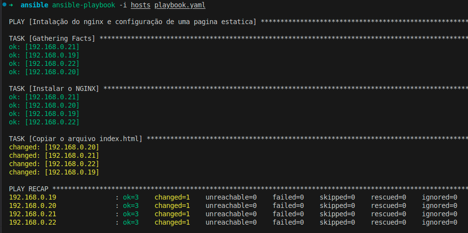
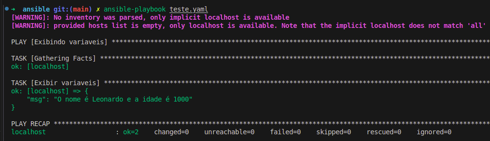

### **Ansible Playbook**

O que é ?

Os Playbooks do Ansible são um conjunto de instruções que especificam como um determinado sistema deve ser configurado ou gerenciado. Eles podem ser usados para automatizar tarefas simples ou complexas e podem ser facilmente compartilhados entre equipes de operações.

Resumindo:
É um conjunto de plays(execuções) utilizando arquivos `yaml`.

## Como configurar

1. Definir o inventário

```ini
[nginx]
192.168.0.19
192.168.0.20
192.168.0.21
192.168.0.22

[nginx:vars]
ansible_user=root
ansible_ssh_private_key_file=~/.ssh/aula_vagrant
```

2. Arquivo `index.html` para subtituição.
```html
<!DOCTYPE html>
<html lang="pt-br">
    <head>
        <title>Titulo da Pagina</title>
        <meta charset="utf-8">
    </head>
    <body>
        <h1>Conteudo do HTML.</h1>
    </body>
</html>
```

3. Arquivo `playbook.yaml`
```yaml
---
# Primeiro play
- name: Intalação do nginx e configuração de uma pagina estatica
  # No hosts pode ser o nome do grupo ou para todos `all`
  hosts: all
  # Lista de tarefas
  tasks:
      # nome da tarefa
    - name: Instalar o NGINX
      # Define o modulo a ser utilizado
      ansible.builtin.apt:
        name: nginx
        state: present
    - name: Copiar o arquivo index.html
      ansible.builtin.copy:
        src: ./index.html
        dest: /var/www/html/index.nginx-debian.html
```

4. Execução.

Agora basta executar o playbook usando o comando abaixo:

```bash
ansible-playbook -i hosts playbook.yaml
```

Se tudo der certo veremos a seguinte saida:


      

## Escala de privilégios

O ansible permite que você execute comandos com diferentes níveis de privilégios, para isso basta adicionar o parâmetro `become` no play ou na tarefa.

```yaml
---
# Primeiro play
- name: Intalação do nginx e configuração de uma pagina estatica
  # No hosts pode ser o nome do grupo ou para todos `all`
  hosts: all
  # Lista de tarefas
  tasks:
      # nome da tarefa
    - name: Instalar o NGINX
      become: true
      # Define o modulo a ser utilizado
      ansible.builtin.apt:
        name: nginx
        state: present
    - name: Copiar o arquivo index.html
      ansible.builtin.copy:
        src: ./index.html
        dest: /home/ansible/index.html
```

O `become` pode ser utilizado no arquivo hosts, para que todas as tarefas sejam executadas com privilégios de root.

```ini
[nginx]
192.168.0.19
192.168.0.20
192.168.0.21
192.168.0.22

[nginx:vars]
ansible_user=root
ansible_ssh_private_key_file=~/.ssh/aula_vagrant
ansible_become=yes
ansible_become_password=123456
ansible_become_user=root
```

Para executar bastar rodar o comando abaixo e informar a senha de sudo:
```bash
ansible-playbook -i hosts playbook.yaml --ask-become-pass
```

## Criação de Usuário com Playbook

```yaml
- name: Criação de usuario leo
  hosts: ping
  remote_user: root
  tasks:
    - name: Criação do usuario leo
      ansible.builtin.user:
        name: leo
        state: present
        shell: /bin/bash
        groups:
          - sudo
        append: yes
        password: $6$EAGUmC3Q6e15EmKF$VpEuiYg.qHyDJFK9NyNjn1VoCuh8fxepIYA.Uuzhp4huQfwc1Y3Q42Q.5V1cvavW8NKvahraSZNNL/Ys9Np8D1
    - name: Criar diretorio .ssh
      ansible.builtin.file:
        path: /home/leo/.ssh
        owner: leo
        group: leo
        state: directory
        recurse: true
    - name: Copiar chave publica
      ansible.builtin.copy:
        # Maquina local
        src: /home/leo/.ssh/aula_ansible.pub
        # Maquina remota
        dest: /home/leo/.ssh/authorized_keys
```

Para gerar a senha utilize o comando abaixo:
```bash
sudo apt install whois
mkpasswd --method=SHA-512
```

## Trabalhando com Variáveis no Ansible

Podemos utilizar variáveis no ansible para facilitar a manutenção dos playbooks e também para reutilização de código.

#### Variáveis no Playbook

Exemplo de utilização de variáveis no playbook local.

```yaml
---
- name: Exibindo variaveis
  hosts: localhost
  vars:
    nome: Leonardo
    idade: 1000
  tasks:
    - name: Exibir variaveis
      ansible.builtin.debug:
        msg: "O nome é {{ nome }} e a idade é {{ idade }}"
```
Ao executar o playbook acima teremos a seguinte saída:



O formato acima ainda é muito limitado, pois as variáveis ficam fixas no playbook, para isso podemos utilizar arquivos de variáveis.

#### Variáveis em arquivos

Para utilizar variáveis em arquivos basta criar um arquivo `vars.yaml` com o seguinte conteúdo e utilizar o comando `include_vars` para carregar as variáveis no playbook.

Arquivo `vars.yaml`:

```yaml
nome: Leonardo
idade: 1000
```

Alteração no playbook:

```yaml
---
- name: Exibindo variaveis
  hosts: localhost
  vars_files:
    - vars.yaml
  tasks:
    - name: Exibir variaveis
      ansible.builtin.debug:
        msg: "O nome é {{ nome }} e a idade é {{ idade }}"
```

## Variaveis em linha de comando

Para passar variáveis via linha de comando basta utilizar o parâmetro `--extra-vars` ou `-e`.

```bash
ansible-playbook -i hosts playbook.yaml --extra-vars "nome=Leonardo idade=1000"
```

Podemos também passar um arquivo com as variáveis utilizando o parâmetro `--extra-vars` ou `-e`.

```bash
ansible-playbook -i hosts playbook.yaml --extra-vars "@vars.yaml"
```

