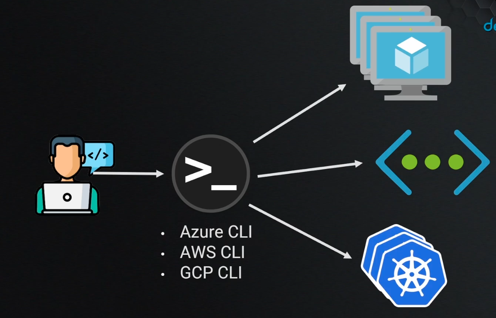
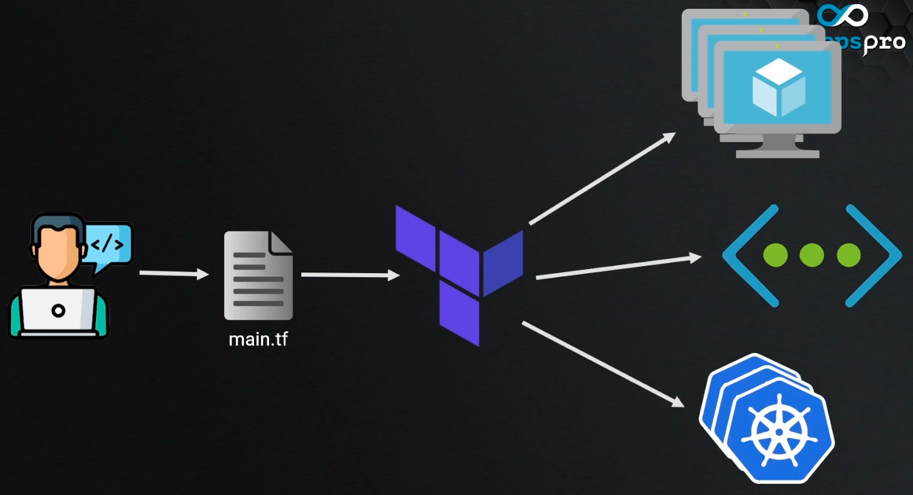
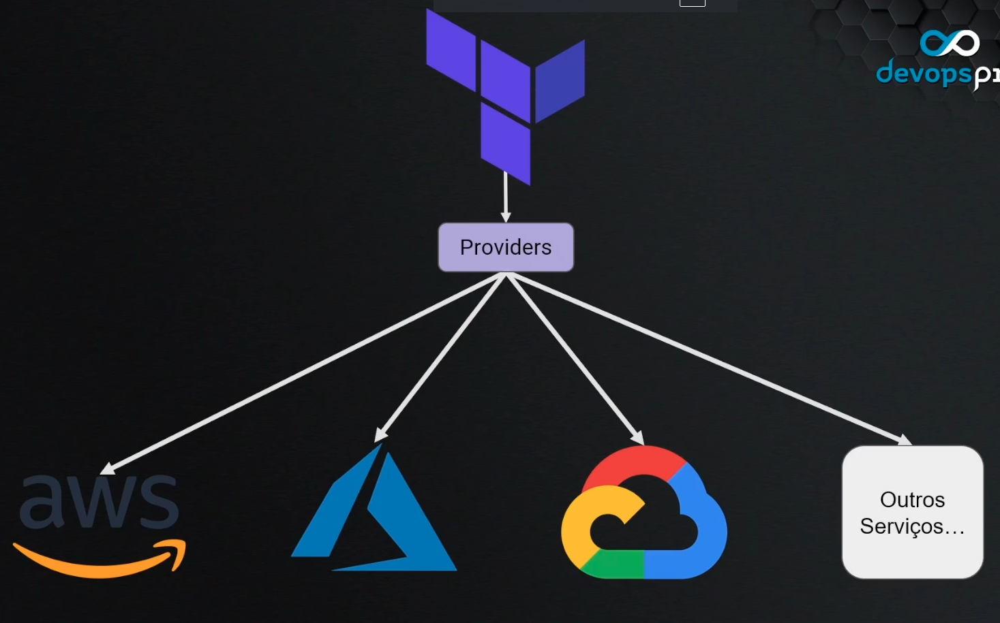

## Terraform

Sem a utiização de terraform, tinhamos que criar todos os recursos via console web do provedor, então teria que ter um passo a passo e uma ordem a ser seguida.
Tornando a gestão mais trabalhosa e demorada.

Poderiamos usar o modo cli dos provedores junto com alguma linguagem como python ou ruby, porem teria uma grande curva de aprendizagem.



Para resolver isso, existe o Terraform, por ser uma ferramenta agnostica, podemos criar como se fosse uma receita de uma infra e aplicar no provedor, dessa forma não precisamos seguir uma ordem especifica, basta declarar os elementos de forma declarativa em uma linguagem unica.



Outro ponto forte, é que o Terraform trabalha com o uso de Providers, que são modulos criados para diferentes locais de provisionamento, ou seja, podemos usar na AWS, GCP, Oracle e até em Bare Metal(Infra local).



## **Hashicorp Configuration Language (HCL)**

O HCL é a linguagem utilizada no Terrafdorm para declarar os objetos, ele é baseado em blocos, segue a estrtura abaixo: 

```terraform
<BLOCK TYPE> "<BLOCK LABEL>" "<BLOCK LABEL>" {
    <IDENTIFIER> = <EXPRESSION>
}
```

- O `block type` define op tipo do bloco, pode ser `output`, `datasource` entre outros.

- O `block label` dependendo do block type podemos ter mais de um `block label`, sempre havera um para definir o nome do projeto e poder ser usado como referencia, posteriormente.

- Dendo do bloco temos o `Identifier` e `Expression`, aqui temos os parametros do block, como rede de IPs e etc.

## **Tipos de blocos**

### Terraform Settings
Nele fica toda a configuração do Terraform do projeto.

```terraform
terraform {
  required_version = ">1.0"
  required_providers{
    digitalocean = {
        source = "digitalocean/digitalocean"
        version = "2.16.0"
    }
  }
}
```

### Providers

Neste bloco é especificado qual o provider será utilizado, e as configurações adicionais do provider para a utilização dele.

Podemos ter mais de um provider em um projeto.

```terraform
provider "digitalocean" {
    token = ""
}
```

### Resources

Este bloco representa um recurso, ou um elemento de cloud.

resource "digitalocean_droplet" "maquina_labs_tf" {
    image   = "ubuntu-20-04-x64"
    name    = "maquina-labs-tf"
    region  = "nyc1"
    size    = "s-1vcpu-2gb"
}

### Data Sources

Este bloco representa um recurso no cloud provider, porem não é criado ou gerenciado pelo terraform, ou seja, um recurso já existente. Esse bloco é mais utilizado quando queremos vincular um recurso existente ao nosso projeto.

```terraform
data "digitalocean_ssh_key" "minha_chave" {
    name    = "aula"
}
```

### Variables

Define um tipo de bloco customizavel.

variable "regiao" {
    type        = string
    default     = "nyc1"
    description = "Regiao de uso na Digital Ocean"
}

### Output

Este bloco é usado para obter o resultado de um parametro do projeto.

output "droplet_ip" {
    value = digitalocean_droplet.maquina_labs_tf.ipv4_address
}