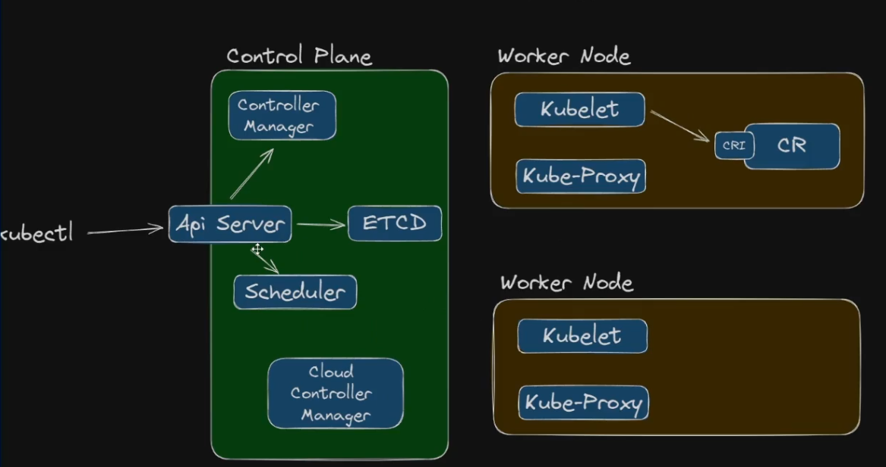

Quando falamos de um cluster, estamos nos referindo a um conjunto de máquinas que, juntas, formam a infraestrutura do cluster.

Cada máquina participante pode assumir um de dois papéis principais, sendo que normalmente cada instância exerce apenas um papel:

- **Control Plane:** Responsável pela gestão e orquestração do cluster.
- **Worker Node:** Responsável pela execução dos containers e aplicações.

### Componentes do Control Plane

O Control Plane é composto por diversos componentes essenciais para o funcionamento do cluster:

- **API Server:** Ponto central de comunicação com o cluster. Todas as operações administrativas e comandos passam por ele.
- **Scheduler:** Responsável por decidir em quais nodes os pods serão executados, otimizando a distribuição de cargas.
- **etcd:** Banco de dados chave-valor que armazena todo o estado do cluster. Para realizar backups do cluster, é necessário copiar os dados do etcd. O acesso ao etcd é sempre feito por meio do API Server, nunca diretamente.
- **Controller Manager:** Gerencia os controladores do cluster, que são responsáveis por manter o estado desejado dos recursos, como ReplicaSets, Deployments, ScaledObjects, entre outros.
- **Cloud Controller Manager:** Em clusters hospedados em nuvem pública, este componente integra o Kubernetes com os serviços da nuvem, sendo responsável por gerenciar recursos específicos do provedor, como balanceadores de carga, endereços IP públicos, armazenamento em bloco e outros serviços externos.

### Componentes do Worker Node

- **Kubelet:** Agente responsável por garantir que os containers descritos nos manifestos estejam em execução e saudáveis no node. Ele se comunica com o Control Plane, reportando o status dos pods e recebendo instruções para criação, atualização ou remoção de containers.

- **Kube-Proxy:** Componente responsável pelo gerenciamento das regras de rede no node, garantindo o roteamento do tráfego de rede para os pods corretos. Ele implementa o balanceamento de carga e permite a comunicação entre serviços dentro do cluster.

- **CRI (Container Runtime Interface):** Interface que permite ao Kubernetes se comunicar com diferentes runtimes de containers, como Docker, containerd ou cri-o. O CRI garante que o Kubelet possa gerenciar containers de forma padronizada, independentemente do runtime utilizado.

- **Container Runtime:** Software responsável por criar, executar e gerenciar o ciclo de vida dos containers nos nodes. Exemplos comuns incluem containerd, cri-o e Docker (embora o suporte direto ao Docker tenha sido depreciado em versões recentes do Kubernetes).

### Informações complementares
Na arquitetura abaixo o exemplo aborda o cluster sem alta disponibilidade (High Availability), para fins de aprendizagem.

Para trabalharmos com HA, o ideal é ter no minimo 3 Control Plane.

