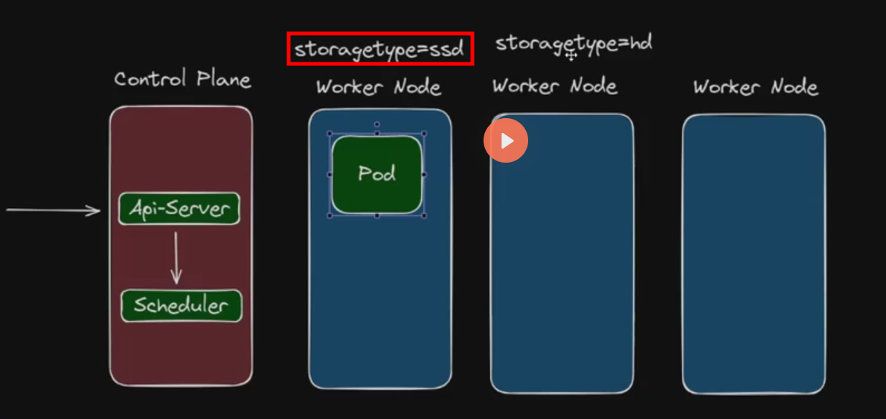

# Horizontal Pod Autoscaler (HPA)
O HPA é um recurso do Kubernetes que ajusta automaticamente o número de réplicas de um Deployment, ReplicaSet ou StatefulSet com base na utilização observada de recursos, como CPU ou memória. Isso ajuda a garantir que sua aplicação tenha a capacidade necessária para lidar com variações na carga de trabalho.

Podemos escalar nossos pods com diversos tipos de métricas, como:
- CPU
- Memória
- Métricas personalizadas (usando o Metrics Server ou outras soluções de monitoramento)
- KEDA (Kubernetes Event-Driven Autoscaling)

Por padrão o HPA obtém a métrica no intervalo de 15 segundos, porém isso pode ser alterado na configuração do Metrics Server.

Exemplo de YAML para um HPA simples com Resource Metrics:

```yaml
apiVersion: autoscaling/v2
kind: HorizontalPodAutoscaler
metadata:
  name: example-hpa
spec:
  scaleTargetRef:
    apiVersion: apps/v1
    kind: Deployment
    name: example-deployment
  minReplicas: 2
  maxReplicas: 10
  metrics:
  - type: Resource
    resource:
      name: cpu
      target:
        type: Utilization
        averageUtilization: 50
  - type: Resource
    resource:
      name: memory
      target:
        type: Utilization
        averageUtilization: 60      
```

# Horizontal Pod Autoscaler - Scaling Up e Scaling Down

Podemos definir o comportamento de scaling up e scaling down do HPA utilizando os campos `behavior`, `scaleUp` e `scaleDown`. Isso nos permite controlar a taxa de escalonamento, evitando mudanças abruptas na quantidade de réplicas.

Exemplo de YAML para um HPA com comportamento personalizado:

```yaml
apiVersion: autoscaling/v2
kind: HorizontalPodAutoscaler
metadata:
  name: example-hpa
spec:
  scaleTargetRef:
    apiVersion: apps/v1
    kind: Deployment
    name: example-deployment    
    minReplicas: 2
    maxReplicas: 10
    metrics:
    - type: Resource
      resource:
        name: cpu
        target:
          type: Utilization
          averageUtilization: 50
  behavior:
    scaleUp:
      stabilizationWindowSeconds: 0 # Tempo para estabilização antes de aumentar réplicas
      policies:
        - periodSeconds: 15
          type: Percent
          value: 100 # Permite dobrar o número de réplicas observadas a cada 15 segundos.
        - periodSeconds: 15
          type: Pods
          value: 2 # Permite adicionar até 2 réplicas a cada 15 segundos.
      selectPolicy: Max # Seleciona a política que permite o maior aumento.
    scaleDown:
      stabilizationWindowSeconds: 10 # Tempo para estabilização antes de diminuir réplicas
      policies:
        - periodSeconds: 15
          type: Percent
          value: 50 # Permite reduzir até 50% do número de réplicas observadas a cada 15 segundos.
        - periodSeconds: 15
          type: Pods
          value: 2 # Permite remover até 2 réplicas a cada 15 segundos.
      selectPolicy: Min # Seleciona a política que permite a menor redução.
```

# Horizontal Pod Autoscaler - Métricas por Container
O HPA pode ser configurado para monitorar métricas específicas de containers dentro dos Pods. Isso é útil quando um Pod contém múltiplos containers e queremos escalar com base no desempenho de um container específico.

Exemplo de YAML para um HPA que monitora métricas específicas de containers:

```yaml
apiVersion: autoscaling/v2
kind: HorizontalPodAutoscaler
metadata:
  name: example-hpa
spec:
  scaleTargetRef:
    apiVersion: apps/v1
    kind: Deployment
    name: example-deployment
    minReplicas: 2
    maxReplicas: 10
    metrics:
    - type: ContainerResource
      containerResource:
        name: example-container
        resource:
          name: cpu
          target:
            type: Utilization
            averageUtilization: 50
    - type: ContainerResource
      containerResource:
        name: example-container
        resource:
          name: memory
          target:
            type: Utilization
            averageUtilization: 60      
```

# Distribuição de Pods no Kubernetes

Para garantir alta disponibilidade e resiliência, é importante distribuir os Pods de maneira adequada entre os nós do cluster. O Kubernetes oferece várias estratégias para controlar essa distribuição, como Node Selector, Node Affinity/Anti-Affinity, Taints e Tolerations, e Pod Topology Spread Constraints.

## Node Selector
O Node Selector é uma maneira simples de direcionar Pods para nós específicos com base em rótulos. Podemos definir rótulos nos nós e usar o Node Selector para garantir que os Pods sejam agendados apenas nesses nós.

Exemplo de YAML para um Pod com Node Selector:

```yaml
apiVersion: v1
kind: Pod
metadata:
  name: example-pod
spec:
  nodeSelector:
    storageType: ssd
  containers:
  - name: example-container
    image: nginx
```



