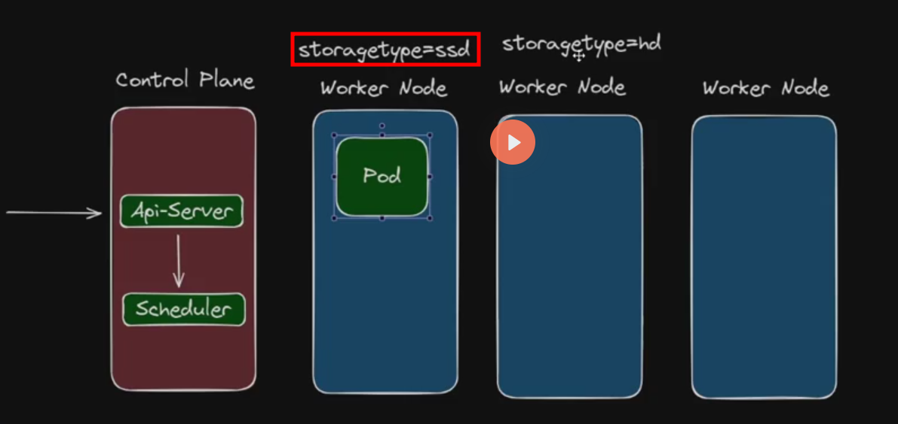

# Horizontal Pod Autoscaler (HPA)
O HPA é um recurso do Kubernetes que ajusta automaticamente o número de réplicas de um Deployment, ReplicaSet ou StatefulSet com base na utilização observada de recursos, como CPU ou memória. Isso ajuda a garantir que sua aplicação tenha a capacidade necessária para lidar com variações na carga de trabalho.

Podemos escalar nossos pods com diversos tipos de métricas, como:
- CPU
- Memória
- Métricas personalizadas (usando o Metrics Server ou outras soluções de monitoramento)
- KEDA (Kubernetes Event-Driven Autoscaling)

Por padrão o HPA obtém a métrica no intervalo de 15 segundos, porém isso pode ser alterado na configuração do Metrics Server.

Exemplo de YAML para um HPA simples com Resource Metrics:

```yaml
apiVersion: autoscaling/v2
kind: HorizontalPodAutoscaler
metadata:
  name: example-hpa
spec:
  scaleTargetRef:
    apiVersion: apps/v1
    kind: Deployment
    name: example-deployment
  minReplicas: 2
  maxReplicas: 10
  metrics:
  - type: Resource
    resource:
      name: cpu
      target:
        type: Utilization
        averageUtilization: 50
  - type: Resource
    resource:
      name: memory
      target:
        type: Utilization
        averageUtilization: 60      
```

# Horizontal Pod Autoscaler - Scaling Up e Scaling Down

Podemos definir o comportamento de scaling up e scaling down do HPA utilizando os campos `behavior`, `scaleUp` e `scaleDown`. Isso nos permite controlar a taxa de escalonamento, evitando mudanças abruptas na quantidade de réplicas.

Exemplo de YAML para um HPA com comportamento personalizado:

```yaml
apiVersion: autoscaling/v2
kind: HorizontalPodAutoscaler
metadata:
  name: example-hpa
spec:
  scaleTargetRef:
    apiVersion: apps/v1
    kind: Deployment
    name: example-deployment    
    minReplicas: 2
    maxReplicas: 10
    metrics:
    - type: Resource
      resource:
        name: cpu
        target:
          type: Utilization
          averageUtilization: 50
  behavior:
    scaleUp:
      stabilizationWindowSeconds: 0 # Tempo para estabilização antes de aumentar réplicas
      policies:
        - periodSeconds: 15
          type: Percent
          value: 100 # Permite dobrar o número de réplicas observadas a cada 15 segundos.
        - periodSeconds: 15
          type: Pods
          value: 2 # Permite adicionar até 2 réplicas a cada 15 segundos.
      selectPolicy: Max # Seleciona a política que permite o maior aumento.
    scaleDown:
      stabilizationWindowSeconds: 10 # Tempo para estabilização antes de diminuir réplicas
      policies:
        - periodSeconds: 15
          type: Percent
          value: 50 # Permite reduzir até 50% do número de réplicas observadas a cada 15 segundos.
        - periodSeconds: 15
          type: Pods
          value: 2 # Permite remover até 2 réplicas a cada 15 segundos.
      selectPolicy: Min # Seleciona a política que permite a menor redução.
```

# Horizontal Pod Autoscaler - Métricas por Container
O HPA pode ser configurado para monitorar métricas específicas de containers dentro dos Pods. Isso é útil quando um Pod contém múltiplos containers e queremos escalar com base no desempenho de um container específico.

Exemplo de YAML para um HPA que monitora métricas específicas de containers:

```yaml
apiVersion: autoscaling/v2
kind: HorizontalPodAutoscaler
metadata:
  name: example-hpa
spec:
  scaleTargetRef:
    apiVersion: apps/v1
    kind: Deployment
    name: example-deployment
    minReplicas: 2
    maxReplicas: 10
    metrics:
    - type: ContainerResource
      containerResource:
        name: example-container
        resource:
          name: cpu
          target:
            type: Utilization
            averageUtilization: 50
    - type: ContainerResource
      containerResource:
        name: example-container
        resource:
          name: memory
          target:
            type: Utilization
            averageUtilization: 60      
```

# Distribuição de Pods no Kubernetes

Para garantir alta disponibilidade e resiliência, é importante distribuir os Pods de maneira adequada entre os nós do cluster. O Kubernetes oferece várias estratégias para controlar essa distribuição, como Node Selector, Node Affinity/Anti-Affinity, Taints e Tolerations, e Pod Topology Spread Constraints.

## Node Selector
O Node Selector é uma maneira simples de direcionar Pods para nós específicos com base em rótulos. Podemos definir rótulos nos nós e usar o Node Selector para garantir que os Pods sejam agendados apenas nesses nós.

Exemplo de YAML para um Pod com Node Selector:

```yaml
apiVersion: v1
kind: Pod
metadata:
  name: example-pod
spec:
  nodeSelector:
    storageType: ssd
  containers:
  - name: example-container
    image: nginx
```




# Labels

Labels são pares chave-valor que podem ser associados a objetos do Kubernetes, como nós (nodes), pods, serviços, etc. Eles são usados para organizar e selecionar subconjuntos de objetos com base em critérios específicos. No contexto de nós (nodes), as labels podem ser usadas para identificar características específicas dos nós, como localização geográfica, tipo de hardware, ambiente (produção, desenvolvimento), etc.

## Gerenciamento de Labels em Nodes

O gerenciamento de labels em nodes envolve a adição, remoção e atualização de labels para refletir as características e o estado atual dos nós. Isso permite que os administradores do Kubernetes organizem e selecionem nós de maneira eficiente para agendamento de pods e outras operações.

### Adicionando Labels a Nodes

Para adicionar uma label a um node, você pode usar o comando `kubectl label`. Por exemplo, para adicionar uma label `environment=production` a um node chamado `node-1`, você pode usar o seguinte comando:

```bash
kubectl label nodes node-1 environment=production
```

### Removendo Labels de Nodes

Para remover uma label de um node, você pode usar o comando `kubectl label` com o sinal de menos (-) para indicar a remoção. Por exemplo, para remover a label `environment` do node `node-1`, você pode usar o seguinte comando:

```bash
kubectl label nodes node-1 environment-
```

# Node Selectors

Node selectors são uma forma de agendar pods em nós específicos com base nas labels associadas a esses nós. Ao definir um node selector em um manifesto de pod, você pode garantir que o pod seja agendado apenas em nós que correspondam às labels especificadas.

```yaml
apiVersion: v1
kind: Pod
metadata:
  name: meu-pod
spec:
  containers:
  - name: meu-container
    image: minha-imagem
  nodeSelector:
    environment: production
```

Neste exemplo, o pod `meu-pod` será agendado apenas em nós que tenham a label `environment=production`. Isso é útil para garantir que os pods sejam executados em ambientes específicos, como produção ou desenvolvimento, ou em nós com características específicas, como tipo de hardware ou localização geográfica.

# Node Affinity

Node affinity é uma forma mais avançada de agendamento de pods em nós com base em labels. Ele permite que você defina regras de afinidade para especificar quais nós são elegíveis para agendamento de pods, usando operadores como `In`, `NotIn`, `Exists`, etc.

```yaml
apiVersion: v1
kind: Pod
metadata:
  name: meu-pod
spec:
  containers:
  - name: meu-container
    image: minha-imagem
  affinity:
    nodeAffinity:
      requiredDuringSchedulingIgnoredDuringExecution:
        nodeSelectorTerms:
        - matchExpressions:
          - key: environment
            operator: In
            values:
            - production
```

Neste exemplo, o pod `meu-pod` será agendado apenas em nós que tenham a label `environment` com o valor `production`. O uso de node affinity permite uma maior flexibilidade na definição de regras de agendamento, permitindo que você especifique critérios mais complexos para a seleção de nós.

#### Tipos de Node Affinity:
- `requiredDuringSchedulingIgnoredDuringExecution`: O pod só será agendado em nós que atendam aos critérios especificados, mas se um nó deixar de atender aos critérios após o agendamento, o pod continuará a ser executado nesse nó.

- `preferredDuringSchedulingIgnoredDuringExecution`: O pod será preferencialmente agendado em nós que atendam aos critérios especificados, mas se nenhum nó atender aos critérios, o pod ainda poderá ser agendado em outros nós.

- `requiredDuringSchedulingRequiredDuringExecution`: O pod só será agendado em nós que atendam aos critérios especificados, e se um nó deixar de atender aos critérios após o agendamento, o pod será desprogramado e reprogramado em outro nó que atenda aos critérios.


#### Tipos de Operadores:
- `In`: O valor da chave deve estar em uma lista de valores especificada.
- `NotIn`: O valor da chave não deve estar em uma lista de valores especificada.
- `Exists`: A chave deve existir, independentemente do valor.
- `DoesNotExist`: A chave não deve existir.
- `Gt`: O valor da chave deve ser maior que um valor especificado (apenas para valores numéricos).
- `Lt`: O valor da chave deve ser menor que um valor especificado (apenas para valores numéricos).

Podemos definir peso para as regras de afinidade usando `preferredDuringSchedulingIgnoredDuringExecution`, onde podemos especificar a preferência de agendamento para nós que atendam aos critérios, mas ainda permitir que o pod seja agendado em outros nós se nenhum nó atender aos critérios.

```yaml
apiVersion: v1
kind: Pod
metadata:
  name: meu-pod
spec:
  containers:
  - name: meu-container
    image: minha-imagem
  affinity:
    nodeAffinity:
      preferredDuringSchedulingIgnoredDuringExecution:
      - weight: 1
        preference:
          matchExpressions:
          - key: environment
            operator: In
            values:
            - production
```

# Pod Affinity e Pod Anti-Affinity

Pod affinity e pod anti-affinity são mecanismos de agendamento que permitem que você defina regras para agendar pods com base na presença ou ausência de outros pods em nós específicos. Isso é útil para garantir que certos pods sejam agendados juntos (pod affinity) ou separados (pod anti-affinity) com base em critérios específicos, como labels.

### Pod Affinity
Pod affinity permite que você defina regras para agendar pods juntos com base em labels. Por exemplo, você pode querer que certos pods sejam agendados no mesmo nó para melhorar a comunicação entre eles.

```yaml
apiVersion: v1
kind: Pod
metadata:
  name: meu-pod
spec:
  containers:
  - name: meu-container
    image: minha-imagem
  affinity:
    podAffinity:
      requiredDuringSchedulingIgnoredDuringExecution:
      - labelSelector:
          matchExpressions:
          - key: app
            operator: In
            values:
            - minha-aplicacao
        topologyKey: kubernetes.io/hostname
```

Neste exemplo, o pod `meu-pod` será agendado em um nó que já tenha um pod com a label `app=minha-aplicacao`, garantindo que os pods sejam agendados juntos.

### Pod Anti-Affinity
Pod anti-affinity permite que você defina regras para agendar pods separados com base em labels. Por exemplo, você pode querer que certos pods sejam agendados em nós diferentes para melhorar a resiliência e evitar pontos únicos de falha. 

```yaml
apiVersion: v1
kind: Pod
metadata:
  name: meu-pod
spec:
  containers:
  - name: meu-container
    image: minha-imagem
  affinity:
    podAntiAffinity:
      requiredDuringSchedulingIgnoredDuringExecution:
      - labelSelector:
          matchExpressions:
          - key: app
            operator: In
            values:
            - minha-aplicacao
        topologyKey: kubernetes.io/hostname
```

Neste exemplo, o pod `meu-pod` será agendado em um nó que não tenha nenhum pod com a label `app=minha-aplicacao`, garantindo que os pods sejam agendados separados.


# Taint e Tolerations

### Tolerations
Tolerations permitem que os pods sejam agendados em nós com taints específicos. Um taint é uma marcação em um nó que impede que certos pods sejam agendados nele, a menos que o pod tenha uma toleration correspondente. Isso é útil para controlar quais pods podem ser executados em nós específicos, garantindo isolamento e controle de recursos.

Exemplo de toleration em um manifesto de pod:

```yaml
apiVersion: v1
kind: Pod
metadata:
  name: meu-pod
spec:
  containers:
  - name: meu-container
    image: minha-imagem
  tolerations:
  - key: "key"
    operator: "Equal"
    value: "value"
    effect: "NoSchedule"
```

Neste exemplo, o pod `meu-pod` tem uma toleration que permite que ele seja agendado em nós que tenham um taint com a chave `key`, valor `value` e efeito `NoSchedule`. Isso significa que o pod pode ser agendado em nós que normalmente não permitiriam a execução de pods sem essa toleration.

### Taints
Taints são aplicados a nós para indicar que eles têm uma condição que impede o agendamento de pods que não toleram essa condição. Um taint é composto por uma chave, um valor e um efeito. O efeito pode ser `NoSchedule`, `PreferNoSchedule` ou `NoExecute`.

Adicionar um taint a um nó usando o comando `kubectl taint`:

```bash
kubectl taint nodes node-1 key=value:NoSchedule
```

Remover um taint de um nó:

```bash
kubectl taint nodes node-1 key=value:NoSchedule-
```

Neste exemplo, o nó `node-1` recebe um taint com a chave `key`, valor `value` e efeito `NoSchedule`. Isso significa que nenhum pod será agendado nesse nó, a menos que ele tenha uma toleration correspondente.


# Estratégias de Atualização da Aplicação 

As estratégias de atualização da aplicação no Kubernetes permitem que você controle como as atualizações de seus aplicativos são realizadas, garantindo alta disponibilidade e minimizando o tempo de inatividade. As principais estratégias de atualização incluem Rolling Update, Recreate e Blue-Green Deployment.

Por padrão, o Kubernetes usa a estratégia de Rolling Update (Ramped Deployment) para atualizações de Deployment, que permite atualizar os pods gradualmente, garantindo que a aplicação continue disponível durante o processo de atualização.

### Recreate Deployment

O Recreate Deployment é uma estratégia de atualização onde todos os pods existentes são terminados antes que os novos pods sejam criados. Isso pode resultar em um período de inatividade, pois não há pods disponíveis para atender às solicitações durante a transição.

Exemplo de YAML para um Recreate Deployment:

```yaml
apiVersion: apps/v1
kind: Deployment
metadata:
  name: meu-deployment
spec:
  replicas: 3
  strategy:
    type: Recreate
  template:
    metadata:
      labels:
        app: minha-aplicacao
    spec:
      containers:
      - name: meu-container
        image: minha-imagem
```

### Ramped Deployment

O Ramped Deployment é uma estratégia de atualização onde os novos pods são criados gradualmente, enquanto os pods antigos são terminados gradualmente. Isso permite que a aplicação continue atendendo às solicitações durante a transição, minimizando o tempo de inatividade.

Exemplo de YAML para um Ramped Deployment:

```yaml
apiVersion: apps/v1
kind: Deployment
metadata:
  name: meu-deployment
spec:
  replicas: 3
  strategy:
    type: RollingUpdate
    rollingUpdate:
      maxUnavailable: 1 # Permite que no máximo 1 pod esteja indisponível durante a atualização
      maxSurge: 1 # Permite que no máximo 1 pod adicional seja criado durante a atualização
  template:
    metadata:
      labels:
        app: minha-aplicacao
    spec:
      containers:
      - name: meu-container
        image: minha-imagem
```

### Blue-Green Deployment

O Blue-Green Deployment é uma estratégia de atualização onde duas versões da aplicação são mantidas simultaneamente: a versão atual (Blue) e a nova versão (Green). Quando a nova versão está pronta, o tráfego é redirecionado para ela, minimizando o tempo de inatividade.

Exemplo de YAML para um Blue-Green Deployment:

```yaml
apiVersion: apps/v1
kind: Deployment
metadata:
  name: meu-deployment-blue
spec:
  replicas: 3
  template:
    metadata:
      labels:
        app: minha-aplicacao
        version: blue
    spec:
      containers:
      - name: meu-container
        image: minha-imagem:blue
---
apiVersion: apps/v1
kind: Deployment
metadata:
  name: meu-deployment-green
spec:
  replicas: 3
  template:
    metadata:
      labels:
        app: minha-aplicacao
        version: green
    spec:
      containers:
      - name: meu-container
        image: minha-imagem:green
```

Após implantar ambas as versões, você pode usar um Service para redirecionar o tráfego para a versão Green quando ela estiver pronta para receber solicitações.

```yaml
apiVersion: v1
kind: Service
metadata:
  name: meu-service
spec:
  selector:
    app: minha-aplicacao
    version: green # Seleciona os pods da versão Green
  ports:
  - protocol: TCP
    port: 80
    targetPort: 8080
```

Para esse modelo é necessário o dobro de recursos, pois ambas as versões da aplicação estão ativas simultaneamente. O tráfego pode ser redirecionado usando um Service que seleciona os pods com a label `version=green` quando a nova versão estiver pronta para receber tráfego.

Porem facilita no processo de rollback, pois basta redirecionar o tráfego de volta para a versão Blue em caso de problemas com a versão Green.

### Canary Deployment

O Canary Deployment é uma estratégia de atualização onde a nova versão da aplicação é implantada para um pequeno subconjunto de usuários ou tráfego, permitindo que você teste a nova versão em um ambiente de produção real antes de fazer a transição completa.

Situação: 
Temos 10 pods rodando a aplicação web, e queremos atualizar para uma nova versão 10% dos pods, ou seja, 1 pod, para testar a nova versão com uma pequena parte do tráfego. Se a nova versão funcionar corretamente, podemos aumentar gradualmente o número de pods com a nova versão até que todos os pods estejam atualizados.

Nesse cenario, teremos 2 deployments: um para a versão atual (Blue) e outro para a nova versão (Green). O deployment Blue terá 9 réplicas, enquanto o deployment Green terá 1 réplica. O tráfego será direcionado para ambos os deployments, permitindo que a nova versão seja testada com uma pequena parte do tráfego. Podendo alterar gradualmente a proporção de tráfego direcionada para a nova versão.

Exemplo de YAML para um Canary Deployment:

```yaml
apiVersion: apps/v1
kind: Deployment
metadata:
  name: meu-deployment-blue
spec:
  replicas: 9
  template:
    metadata:
      labels:
        app: minha-aplicacao
    spec:
      containers:
      - name: meu-container
        image: minha-imagem:blue
  strategy:
    type: RollingUpdate
    rollingUpdate:
      maxUnavailable: 1
      maxSurge: 1
---
apiVersion: apps/v1
kind: Deployment
metadata:
  name: meu-deployment-green
spec:
  replicas: 1
  template:
    metadata:
      labels:
        app: minha-aplicacao
    spec:
      containers:
      - name: meu-container
        image: minha-imagem:green
  strategy:
    type: RollingUpdate
    rollingUpdate:
      maxUnavailable: 1
      maxSurge: 1
```

Neste exemplo, a nova versão da aplicação é implantada como um canário, com uma pequena porcentagem do tráfego direcionada para ela. Isso permite que você monitore o desempenho e a estabilidade da nova versão antes de fazer a transição completa para todos os usuários. Se a nova versão apresentar problemas, você pode facilmente reverter para a versão anterior sem afetar a maioria dos usuários.
