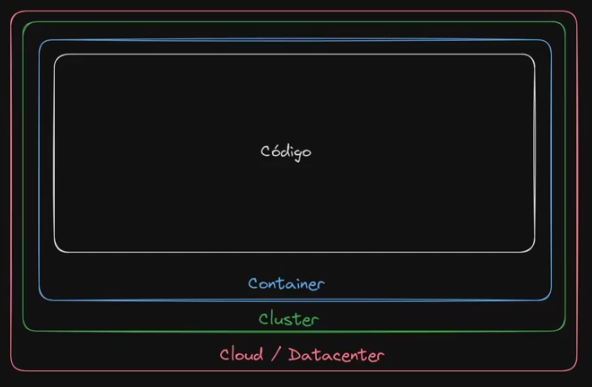

# Introdução

Trabalharemos com os 4 Cs de segurança da Cloud Native 

1 - Cloud/Datacenter - Nesta camada é relacionado sobre as práticas de segurança de recursos.

2 - Cluster - Segurança encima do kubernetes, em clustes gerenciados o gerenciamento é compartilhado com o cloud provider como AWS e afins, agora em um cluster gerenciado localmente terá mais responsábilidades para gerenciar.

3 - Container - Relacionado a segurança da construção do container e ferramentas para garantir essa segurança.

4 - Código - Aqui entra a parte em quais itens eu posso usar para garantir a segurança na aplicação, exemplo nao colocar senhas em Hardcoded. 

Nós tópicos abaixo será abordado sobre segurança no nivel do Cluster.

## Security Context

