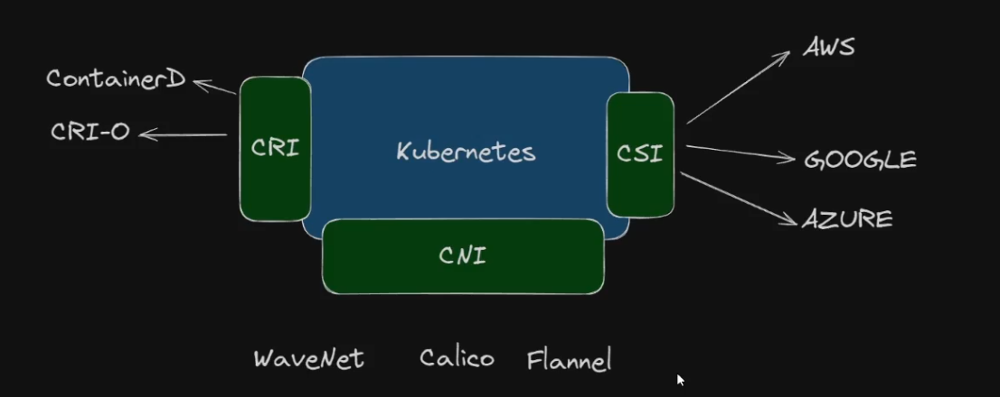

O Kubernetes é flexível e permite que algumas funções sejam realizadas por ferramentas de terceiros. Para garantir que tudo funcione junto, existem interfaces de comunicação padronizadas, chamadas APIs, que permitem a integração e compatibilidade entre os componentes do cluster.

- **CRI (Container Runtime Interface):** Interface que permite ao Kubernetes se comunicar com diferentes runtimes de containers.

Por muito tempo o Docker foi utilizado, mas com a padronização da CRI, outros runtimes como containerd e CRI-O passaram a ser recomendados e o uso direto do Docker foi descontinuado.

Ecemplos: CRI-O, containerD.

- **CNI (Container Network Interface):** Interface que padroniza a comunicação de rede entre os pods e permite a integração de diferentes soluções de rede no cluster.

Exemplos: Weave Net, Calico, Flannel.

- **CSI (Container Storage Interface):** Interface que padroniza a integração de soluções de armazenamento externo ao cluster, permitindo o uso de diferentes provedores de storage em cloud ou on-premise.

Exemplos: AWS, Google Cloud, Azure, Longhorn.

