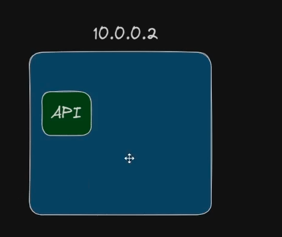

## Pod

### O que é um Pod?
Pod é o menor elemento do cluster Kubernetes, onde são executados os containers. 

### Por que não é recomendado ter mais de um container por pod?
Ter mais de um container por pod pode levar a problemas de escalabilidade e gerenciamento. Se você precisar escalar sua aplicação, terá que escalar todos os containers juntos, mesmo que apenas um deles precise de mais recursos. Isso pode resultar em desperdício de recursos e aumento de custos.
Além disso, ter mais de um container por pod pode tornar mais difícil o gerenciamento e a manutenção da aplicação, pois você terá que lidar com mais containers e suas interações.
O ideal é ter um container por pod, que é o padrão recomendado pelo Kubernetes. Isso facilita a escalabilidade, o gerenciamento e a manutenção da aplicação, além de seguir as melhores práticas de design de software.


Nesse cenario se tivermos um API, Banco de dados e o front-end(UI), se quisermos  escalar nossa aplicação, ele irá escalar tudo que tem dentro de pod, ou seja, se temos 3 containers dentro de um pod e escalamos para 3 réplicas, teremos 9 containers no total.

### Cenario ideal 
O ideal é ter um pod para cada container, assim podemos escalar cada container de forma independente.



### Mas por que podemos ter mais de um container?
Existem algumas situações onde é necessário ter mais de um container dentro de um pod, como por exemplo:
- **Sidecar**: Um container que complementa o container principal, como um coletor de logs ou um proxy reverso.
- **Ambassador**: Um container que atua como um intermediário entre o container principal e o mundo externo, como um balanceador de carga ou um gateway de API.
- **Adapter**: Um container que adapta a comunicação entre o container principal e outros serviços, como um conversor de protocolo ou um tradutor de dados.
- **Init Containers**: Containers que são executados antes do container principal, para preparar o ambiente, como a criação de diretórios ou a configuração de variáveis de ambiente.


### Como criar um Pod?
Para criar um Pod, você pode usar um arquivo de configuração YAML. Aqui está um exemplo básico de um Pod com um único container:
```yaml
apiVersion: v1
kind: Pod
metadata:
  name: my-pod
spec:
  containers:
    - name: my-container
      image: nginx:latest
      ports:
        - containerPort: 80
```

Para criar o Pod, você pode usar o comando `kubectl apply -f <nome-do-arquivo>.yaml`. Isso criará o Pod no cluster Kubernetes.

Nesse exemplo, estamos criando um Pod chamado `my-pod` com um container chamado `my-container` que usa a imagem `nginx:latest`. O container está configurado para expor a porta 80.

Nesse modelo ele não possui escalabilidade e resiliência, ou seja, se o container falhar, o Pod não será reiniciado automaticamente. Para isso, é recomendado usar um controlador acima do Pod, por exemplo, o ReplicaSet.