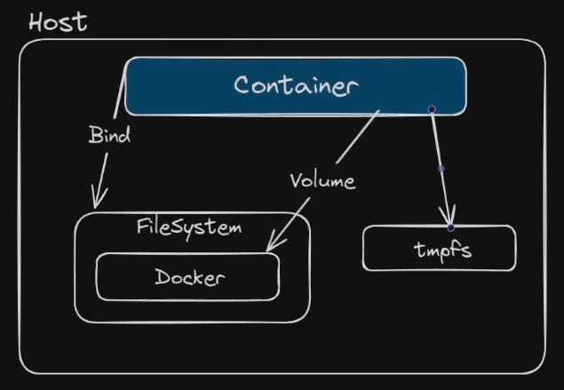

O volume `tmpfs` no Docker refere-se a um tipo especial de volume que é mantido na memória RAM em vez de ser armazenado no disco físico. Esse tipo de volume é temporário e é frequentemente usado quando se deseja armazenar dados efêmeros ou quando é necessário um armazenamento de leitura/gravação de alta velocidade.

Ao criar um volume `tmpfs` em um contêiner Docker, você está alocando uma parte da memória RAM para ser usada como um sistema de arquivos temporário. Isso pode ser útil em situações em que você precisa de um armazenamento rápido para dados temporários, como caches, logs temporários ou qualquer outra informação que não precise ser persistente entre reinicializações do contêiner.

  

Obs.: Ele não pode ser compartilhado, somente o container tem acesso.

  



  

```Bash
docker run -d --name meu_contenedor --tmpfs /caminho/no/container:size=100m ubuntu:22.04
#OU
docker run -it --mount type=tmpfs,target=/app ubuntu:22.04
```