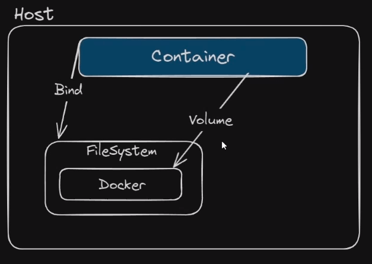

Um volume gerenciado pelo Docker é uma forma de persistir dados entre os containers em execução. O Docker permite criar e gerenciar volumes para que os dados possam ser compartilhados e persistidos de forma consistente.

Os volumes são usados para armazenar e compartilhar dados entre os containers, independentemente de onde estejam sendo executados. Eles são criados e gerenciados pelo Docker, o que significa que você pode criar, listar, visualizar e remover volumes usando comandos do Docker.

Para criar um volume, você pode usar o comando `docker volume create`. Isso criará um novo volume que pode ser usado por um ou mais containers. Para listar os volumes existentes, você pode usar o comando `docker volume ls`. E para remover um volume, você pode usar o comando `docker volume rm`.

Além disso, você pode especificar um volume ao executar um container usando a opção `-v` ou `--volume`. Isso permite que você monte o volume em um diretório específico dentro do container.

O Docker também oferece suporte a diferentes tipos de volumes, como volumes de host, volumes anônimos e volumes gerenciados por drivers externos. Cada tipo de volume tem suas próprias características e casos de uso específicos.

Em resumo, um volume gerenciado pelo Docker é uma forma de persistir e compartilhar dados entre os containers em execução. Eles podem ser criados, listados e removidos usando comandos do Docker e podem ser montados em diretórios específicos dentro dos containers.

  



## Exemplo no Dockerfile

```Docker
FROM ubuntu:22.04
VOLUME /app
```

Se eu não mapear o volume como no caso acima, o docker irá criar um automaticamente para mim.

---

### Criar volume:

Para criar um volume no Docker, você pode usar o comando `docker volume create`. Isso criará um novo volume que pode ser usado por um ou mais containers. Em seguida, para mapear o volume em um diretório específico dentro de um container, você pode usar a opção `-v` ou `--volume` ao executar o container.

Por exemplo, para criar um volume chamado "meu_volume" e mapeá-lo para o diretório "/app" dentro de um container, você pode usar o seguinte comando:

```Shell
#Criando o volume
docker volume create meu_volume

#Mapear o volume no container
docker run -it --mount type=volume,source=meu_volume,target=/app
OU
docker run -v meu_volume:/app meu_container
```

Isso criará o volume "meu_volume" e o montará no diretório "/app" dentro do container "meu_container".

Caso eu exclua o container os arquivos iram ser persistidos, se eu criar um novo container e montar o volume novamente ele estará lá.

### Listar volume:

O comando para listar os volumes existentes no Docker é `docker volume ls`.

```Shell
#Listando volumes
docker volume ls
```

### Inspecionando volume:

O comando para inspecionar um volume existente no Docker é `docker volume inspect`. Isso permite que você obtenha informações detalhadas sobre um volume específico, como o nome, o driver utilizado, o ponto de montagem e outras propriedades.

Por exemplo, para inspecionar o volume "meu_volume", você pode usar o seguinte comando:

```Shell
# Inspecionar volume
docker volume inspect meu_volume
```

Isso retornará um JSON com os detalhes do volume, incluindo o seu nome, driver, ponto de montagem e outras informações relevantes.

### Excluindo volume:

O comando para listar os volumes existentes no Docker é `docker volume ls`.

```Shell
#Listando volumes
docker volume rm meu_volume
```

### Limpando volumes não usados:

O comando para listar os volumes existentes no Docker é `docker volume prune`.

```Shell
#Limpando volumes
#Obs.: muito cuidado.
docker volume prune
```

  
### Backup de volume:

Podemos ter o cenário onde criamos um container e paramos de executar, porem esquecemos de salvar o volume.

Existe um recurso no docker que consegue mapear todos os volumes do container e fazer o backup.

```Shell
#Backup zipado
docker run --volumes-from <id_container> --rm -v <diretorio_destino_host>:/backup ubuntu:22.04 tar cvf /backup/backup_vol.tar /app
```

- `docker run`: Inicia um contêiner.
- `-volumes-from <id_container>`: Monta os volumes do contêiner especificado no novo contêiner, permitindo o acesso aos dados do contêiner original.
- `-rm`: Remove automaticamente o contêiner após a conclusão do comando.
- `v <diretorio_destino_host>:/backup`: Mapeia um diretório no host para o diretório `/backup` dentro do contêiner, onde o backup será armazenado.
- `ubuntu:22.04`: Usa a imagem do Ubuntu com a versão 22.04 como base para o contêiner.
- `tar cvf /backup/backup_vol.tar /app`: Cria um arquivo de backup chamado `backup_vol.tar` dentro do diretório `/backup` do contêiner, incluindo todos os dados do diretório `/app` do contêiner.

  

Após os passos anteriores posso criar um novo volume e montar no novo container e descompactar o backup.

```Bash
#Cria o volume gerenciado.
docker volume create novo_volume
#Restore do backup
docker run -v <local_backup_host>:/backup -v novo_volume:/app ubuntu:22.04 tar xvf /backup/backup_vol.tar
```

  
Mais detalhes:

Documentação sobre o Backup/Restore.

[https://docs.docker.com/storage/volumes/#back-up-restore-or-migrate-data-volumes](https://docs.docker.com/storage/volumes/#back-up-restore-or-migrate-data-volumes)

