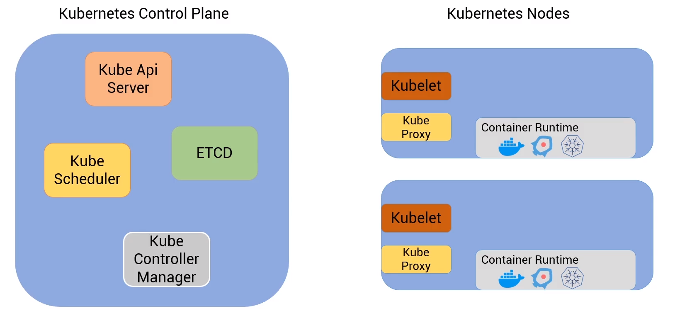

## Arquitetura do cluster

  

**Kubernetes Control Plane**: É o responsável por gerenciar os containers, é por ele que os comandos do kubectl se comunica ou através de API (Kube API Server).

**ETCD**: É um banco que armazena todos os dados do cluster. o acesso é somente pelo Kube API Server

**Kube Scheduler**: O manifesto de deploy é lido e analisado para ver onde será executado, se tem capacidade e em qual nó será executado.

**Kube Controller Manager**: Gerencia todos os controladores do cluster Kubernetes. Exemplo: ReplicaSet, Admission Controller, inclusive controles criados manualmente e otimizações será gerenciado por ele .

---

**Kubernetes Nodes**: Responsável por executar os workloads.

**Kubelet**: É responsável por se comunicar com o _**Kube Controller Manager**_ através do _Kube API Server_. Ele monitora e analisa o estado do nó. Ele verifica o estado do nó que está sendo executado.

**Kube Proxy**: Responsável pela comunicação entre os nos.

**Container Runtime**: Responsável por executar os containers geralmente utiliza o Docker, porem há outros.

  

[[2 - Criando clusters]]

[[3 - POD]]

[[4 - ReplicaSet]]