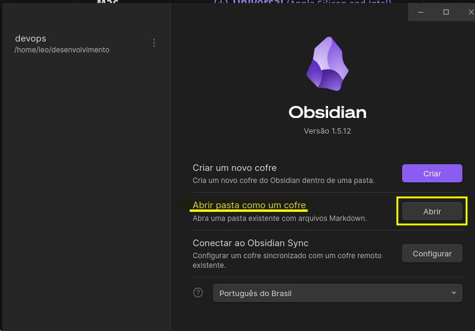

Configurando Obsidian para gerenciar/visualizar a documentação.

Instalar o Obsidian conforme link https://obsidian.md/download

Faça o clone do repositório https://github.com/leonardogoandete/devops e salve no local desejado.

Após a instalação e o clone, abra o programa e na tela abaixo clique no botão `Abrir` ao lado do texto `Abrir pasta como um cofre`.

Selecione a pasta que foi clonada `devops` e pronto ; ) . 